# BÁO CÁO KHẢO SÁT & ĐẶC TẢ YÊU CẦU HỆ THỐNG
## 3.1. GIAI ĐOẠN LẬP KẾ HOẠCH – KHẢO SÁT YÊU CẦU
### ĐỀ TÀI: HỆ THỐNG NHẬN DIỆN BIỂN SỐ XE & QUẢN LÝ BÃI XE THÔNG MINH (AI SMART PARKING SYSTEM)

---

> **Môn học**: Công nghệ phần mềm (CNPM24)  
> **Lá»›p**: 24CT2  
> **Sinh viên thực hiện**: Ông Thân Quốc Trường  
> **Trường**: Đại học Kiến trúc Đà Nẵng (DAU)  
> **Giảng viên hướng dẫn**: ThS. Phạm Thị Dung  
> **Công nghệ áp dụng**: Python (Flask) + YOLOv8 + CRNN-CTC/EasyOCR + MySQL + HTML5/CSS3/Vanilla JS (SPA)  
> **Các giải pháp/sản phẩm mẫu tham khảo (Benchmark Links)**:
> 1. **Sighthound ALPR Demo**: [https://www.sighthound.com/products/alpr/demo](https://www.sighthound.com/products/alpr/demo)
> 2. **Plate Recognizer**: [https://platerecognizer.com/](https://platerecognizer.com/)
> 3. **VietANPR - Viscom Solution**: [https://viscomsolution.com/vietanpr-phan-mem-nhan-dien-bien-so-xe/](https://viscomsolution.com/vietanpr-phan-mem-nhan-dien-bien-so-xe/)

---

## I. NGUYÊN TẮC VIẾT YÊU CẦU RÕ RÀNG (MỤC 3.1)

Trong giai đoạn khảo sát yêu cầu phần mềm, việc phân định mức độ ưu tiên và viết tiêu chí nghiệm thu được chuẩn hóa như sau:
1. **Yêu cầu Chức năng (Functional Requirements - FR)**: Là các chức năng nghiệp vụ bắt buộc phải có để hệ thống vận hành $\rightarrow$ **Mức độ ưu tiên luôn luôn là CAO**, đánh số tăng dần liên tục (`FR-01`, `FR-02`, `FR-03`, ...).
2. **Yêu cầu Phi Chức năng (Non-Functional Requirements - NFR)**: Là các chỉ tiêu kỹ thuật về chất lượng, hiệu năng, độ tin cậy và bảo mật $\rightarrow$ **Mức độ ưu tiên luôn luôn là TRUNG BÌNH**, đánh số tăng dần liên tục (`NFR-01`, `NFR-02`, `NFR-03`, ...).
3. **Cấu trúc bảng đặc tả chuẩn 7 cột**:
   - Cột 1: **Mã** (Mã định danh yêu cầu tăng dần)
   - Cột 2: **Tên yêu cầu** (Ngắn gọn, súc tích)
   - Cột 3: **Mô tả yêu cầu** (Diễn đạt rõ tác nhân và hành vi hệ thống: *"Người dùng/Hệ thống có thể..."*)
   - Cột 4: **Ưu tiên** (Quy chuẩn: FR luôn là **Cao**, NFR luôn là **Trung bình**)
   - Cột 5: **Tiêu chí nghiệm thu (Acceptance Criteria)** (Điều kiện kiểm thử Đúng/Sai đo lường được)
   - Cột 6: **Link mẫu** (Liên kết giải pháp thực tế được khảo sát: *Sighthound ALPR*, *Plate Recognizer*, *VietANPR* và giao diện thực tế của đồ án)
   - Cột 7: **Đã hoàn thành** (Cột kiểm tra tiến độ hiện thực hóa và nghiệm thu tính năng trong mã nguồn dự án)

---

## II. BẢNG ĐẶC TẢ YÊU CẦU CHỨC NĂNG (FUNCTIONAL REQUIREMENTS - FR)

> **Quy chuẩn**: Toàn bộ yêu cầu chức năng (FR) có mức ưu tiên luôn là **Cao**, đánh số thứ tự tăng dần từ `FR-01` đến `FR-15`, tên yêu cầu ngắn gọn, chuẩn mực công nghệ phần mềm, tách bạch rõ ràng giữa đăng nhập hệ thống, đăng ký tài khoản, đăng ký phương tiện, chọn bãi đỗ xe đến các quy trình kiểm soát AI và quản trị.

| Mã | Tên yêu cầu | Mô tả yêu cầu | Ưu tiên | Tiêu chí nghiệm thu (Acceptance Criteria) | Link mẫu (Tham khảo & Giao diện) | Đã hoàn thành |
| :---: | :--- | :--- | :---: | :--- | :--- | :---: |
| **FR-01** | Đăng nhập hệ thống | Người dùng (Quản trị viên, Nhân viên bảo vệ, Cư dân) đăng nhập vào hệ thống bằng tài khoản và mật khẩu để truy cập theo đúng phân quyền. | **Cao** | - Đăng nhập đúng $\rightarrow$ Điều hướng vào đúng trang làm việc theo vai trò (`/` cho Admin/Bảo vệ, `/resident-dashboard` cho Cư dân). - Đăng nhập sai hoặc tài khoản bị khóa $\rightarrow$ Hiển thị thông báo lỗi rõ ràng, giữ lại tên tài khoản. | • [VietANPR - Phân quyền người dùng](https://viscomsolution.com/vietanpr-phan-mem-nhan-dien-bien-so-xe/) • [Giao diện Đăng nhập](file:///d:/CNPM24CT2_OngThanQuocTruong/ongthanquoctruong_24CT2_cnpm/fe/templates/login.html) (`/login`) | **[✔] Đã hoàn thành** |
| **FR-02** | Đăng ký tài khoản | Cho phép cư dân mới tự đăng ký tài khoản trực tuyến trên hệ thống với thông tin căn hộ, họ tên, số điện thoại và mật khẩu. | **Cao** | - Nhập đầy đủ thông tin hợp lệ $\rightarrow$ Tạo tài khoản thành công, mật khẩu mã hóa an toàn PBKDF2/SHA-256, tự động gán quyền `Resident`. - Kiểm tra và cảnh báo nếu tên tài khoản (username) hoặc số điện thoại đã tồn tại. - Đăng ký thành công $\rightarrow$ Có thể đăng nhập ngay vào Cổng Dịch Vụ Cư Dân. | • [VietANPR - Quản lý tài khoản khách hàng](https://viscomsolution.com/vietanpr-phan-mem-nhan-dien-bien-so-xe/) • [Form Đăng Ký Tài Khoản](file:///d:/CNPM24CT2_OngThanQuocTruong/ongthanquoctruong_24CT2_cnpm/fe/templates/login.html) | **[✔] Đã hoàn thành** |
| **FR-03** | Đăng ký phương tiện | Cư dân có thể đăng ký phương tiện ô tô mới cho căn hộ, khai báo biển số, chủ xe, số điện thoại và đăng ký gói vé tháng định kỳ. | **Cao** | - Biển số xe được tự động chuẩn hóa định dạng xe cơ giới Việt Nam (VD: `30A-123.45`). - Kiểm tra và ngăn chặn đăng ký trùng biển số đang hoạt động trong hệ thống. - Phương tiện sau khi đăng ký hiển thị ngay trên thẻ xe 3D tại Cổng Cư Dân. | • [VietANPR - Quản lý xe cư dân](https://viscomsolution.com/vietanpr-phan-mem-nhan-dien-bien-so-xe/) • [Cổng Dịch Vụ Cư Dân](file:///d:/CNPM24CT2_OngThanQuocTruong/ongthanquoctruong_24CT2_cnpm/fe/templates/resident_dashboard.html#vehiclesSection) | **[✔] Đã hoàn thành** |
| **FR-04** | Chọn vị trí bãi đỗ xe | Hiển thị sơ đồ bãi xe mô phỏng rạp chiếu phim (Cinema Seat Style) với 100 ô đỗ 2 tầng hầm; cho phép cư dân chọn vị trí trống khi đăng ký xe và đổi vị trí linh hoạt. | **Cao** | - Hiển thị trực quan 100 vị trí đỗ ô tô tại 2 tầng hầm (Hầm B1 và Hầm B2: Dãy A, B, C, D, E, F, VIP). - Trạng thái màu sắc theo chuẩn rạp phim: Xanh lá (Trống), Đỏ (Đã có xe), Xanh dương (Đang chọn), Vàng (VIP), Cyan (Xe của bạn). - Chống chọn trùng vị trí đỗ (Conflict 400); hỗ trợ đổi vị trí đỗ tức thời trên giao diện. - Vị trí số 01 luôn hiển thị đầu hàng, không bị che khuất; tự động cuộn (scrollIntoView) mượt mà đến ô đang chọn. | • [CGV / Cinema Seat Booking Layout](https://www.cgv.vn/) • [Sơ đồ Bãi Xe Cinema](file:///d:/CNPM24CT2_OngThanQuocTruong/ongthanquoctruong_24CT2_cnpm/fe/templates/resident_dashboard.html#cinemaModal) | **[✔] Đã hoàn thành** |
| **FR-05** | Nhận diện biển số từ camera | Hệ thống camera tự động phát hiện vị trí biển số (YOLOv8) và nhận dạng ký tự quang học (CRNN/EasyOCR) theo thời gian thực khi xe đến cổng. | **Cao** | - Tự động vẽ khung chữ nhật nhận diện (Bounding Box) màu xanh lá trên khung hình video. - Đọc và chuẩn hóa chuỗi ký tự biển số theo mẫu biển Việt Nam với độ tin cậy $confidence \ge 0.5$. | • [Plate Recognizer - Live Camera ANPR](https://platerecognizer.com/) • [Sighthound ALPR Demo](https://www.sighthound.com/products/alpr/demo) • [Tab Nhận Diện Biển Số](file:///d:/CNPM24CT2_OngThanQuocTruong/ongthanquoctruong_24CT2_cnpm/fe/templates/index.html#recognition-page) | **[✔] Đã hoàn thành** |
| **FR-06** | Nhận diện biển số từ hình ảnh | Cho phép người dùng hoặc kỹ thuật viên tải ảnh chụp xe (.jpg, .png) lên hệ thống để kiểm tra khả năng nhận diện của mô hình AI. | **Cao** | - Tải ảnh lên $\rightarrow$ trả về ảnh kết quả đã khoanh vùng biển số, chuỗi ký tự nhận diện, độ tin cậy và thời gian xử lý $< 1$ giây. - Hiển thị kết quả trực quan trên giao diện thử nghiệm. | • [Sighthound ALPR Demo - Image Test](https://www.sighthound.com/products/alpr/demo) • [Plate Recognizer Snapshot API](https://platerecognizer.com/) • [Khu Vực Tải Ảnh Thử Nghiệm](file:///d:/CNPM24CT2_OngThanQuocTruong/ongthanquoctruong_24CT2_cnpm/fe/templates/index.html#test-image-section) | **[✔] Đã hoàn thành** |
| **FR-07** | Kiểm soát xe vào (Check-In) | Khi xe tiến vào cổng vào, hệ thống tự động nhận diện biển số, chụp ảnh snapshot lưu trữ và tạo phiên gửi xe mới. | **Cao** | - Tự động tạo bản ghi mới trong bảng `parking_sessions` với trạng thái `Parked`. - Lưu ảnh chụp xe vào thư mục snapshot `artifacts/snapshots/`. - Đồng bộ tức thời sang bảng `lich_su_ra_vao` với trạng thái `DangDo`. | • [VietANPR - Quản lý xe vào cổng](https://viscomsolution.com/vietanpr-phan-mem-nhan-dien-bien-so-xe/) • [Trang Lượt Xe Ra/Vào](file:///d:/CNPM24CT2_OngThanQuocTruong/ongthanquoctruong_24CT2_cnpm/fe/templates/index.html#sessions-page) | **[✔] Đã hoàn thành** |
| **FR-08** | Kiểm soát xe ra (Check-Out) | Khi xe tiến vào cổng ra, hệ thống tự động tìm phiên đỗ xe đang mở, tính toán chính xác thời gian đỗ theo phút. | **Cao** | - Truy vấn tìm phiên `status = 'Parked'` gần nhất của biển số xe. - Tính chính xác khoảng thời gian: `TIMESTAMPDIFF(MINUTE, check_in_time, NOW())`. - Hiển thị thời lượng đỗ định dạng `X giờ Y phút` lên màn hình đối soát. | • [VietANPR - Kiểm soát làn ra bãi xe](https://viscomsolution.com/vietanpr-phan-mem-nhan-dien-bien-so-xe/) • [Bàn Trực Đối Soát Ra/Vào](file:///d:/CNPM24CT2_OngThanQuocTruong/ongthanquoctruong_24CT2_cnpm/fe/templates/index.html#guard-station-page) | **[✔] Đã hoàn thành** |
| **FR-09** | Đối chiếu hình ảnh vào - ra | Khi xe ra, màn hình nhân viên trực hiển thị song song ảnh chụp lúc vào và ảnh thực tế lúc ra để kiểm tra tính toàn vẹn (chống đổi biển/trộm xe). | **Cao** | - Hiển thị bố cục 2 cột side-by-side: Cột trái [Ảnh vào + Giờ vào + Camera vào], Cột phải [Ảnh ra + Giờ ra + Biển số quét được]. - Hiển thị tên chủ xe, số điện thoại, mã căn hộ nếu là xe cư dân. | • [VietANPR - Bàn trực đối chiếu ảnh vào ra](https://viscomsolution.com/vietanpr-phan-mem-nhan-dien-bien-so-xe/) • [Khung Đối Chiếu Side-by-Side](file:///d:/CNPM24CT2_OngThanQuocTruong/ongthanquoctruong_24CT2_cnpm/fe/templates/index.html#verify-card-grid) | **[✔] Đã hoàn thành** |
| **FR-10** | Tính cước phí tự động | Hệ thống tự động tính số tiền cần thu dựa trên thời lượng đỗ và phân loại phương tiện (Vé tháng cư dân = 0 VNĐ, Vãng lai = theo biểu phí). | **Cao** | - Xe Whitelist / Vé tháng còn hạn $\rightarrow$ Cước phí hiển thị: **0 VNĐ** (Lý do: *"Vé tháng cư dân còn hiệu lực"*). - Xe vãng lai $\rightarrow$ Tính tiền lũy tiến theo block giờ quy định. - Xe vé tháng hết hạn $\rightarrow$ Cảnh báo vé hết hạn và tự động tính cước lượt. | • [VietANPR - Tính phí gửi xe tự động](https://viscomsolution.com/vietanpr-phan-mem-nhan-dien-bien-so-xe/) • [Hộp Tính Phí Bàn Trực](file:///d:/CNPM24CT2_OngThanQuocTruong/ongthanquoctruong_24CT2_cnpm/fe/templates/index.html#guardFeeBox) | **[✔] Đã hoàn thành** |
| **FR-11** | Cảnh báo an ninh xe Blacklist | Tự động phát hiện và bật cảnh báo khẩn cấp khi xe thuộc Danh sách đen (Blacklist / Xe vi phạm / Nghi vấn trộm cắp) xuất hiện. | **Cao** | - Bật hộp cảnh báo ĐỎ RỰC chớp nháy: *"🚨 CẢNH BÁO AN NINH: XE BLACKLIST - TỪ CHỐI CHO QUA"*; phát chuông còi báo động. - Tự động vô hiệu hóa nút mở barrier, yêu cầu bảo vệ giữ xe kiểm tra an ninh. | • [Plate Recognizer - Blacklist & Alert](https://platerecognizer.com/) • [VietANPR - Cảnh báo xe vi phạm](https://viscomsolution.com/vietanpr-phan-mem-nhan-dien-bien-so-xe/) • [Hộp Cảnh Báo An Ninh Blacklist](file:///d:/CNPM24CT2_OngThanQuocTruong/ongthanquoctruong_24CT2_cnpm/fe/templates/index.html#guardBlacklistAlert) | **[✔] Đã hoàn thành** |
| **FR-12** | Xác nhận thu phí & Mở Barrier | Nhân viên bảo vệ xác nhận thu tiền $\rightarrow$ hệ thống hoàn tất phiên gửi xe, tạo mã hóa đơn điện tử và phát xung mở barrier tự động. | **Cao** | - Bấm "Xác Nhận Thu Phí & Mở Barrier": Trạng thái phiên chuyển thành `Completed`, lưu số tiền đã thu. - Tự động tạo mã hóa đơn điện tử định dạng `HD-XXXXXX`. - Kích hoạt lệnh mở Barrier cổng ra và thông báo cho xe qua cổng an toàn. | • [VietANPR - Điều khiển Barrier & In hóa đơn](https://viscomsolution.com/vietanpr-phan-mem-nhan-dien-bien-so-xe/) • [Nút Thu Phí & Kích Hoạt Barrier](file:///d:/CNPM24CT2_OngThanQuocTruong/ongthanquoctruong_24CT2_cnpm/fe/templates/index.html#guardConfirmActionBtn) | **[✔] Đã hoàn thành** |
| **FR-13** | Quản lý danh mục phương tiện | Quản trị viên và bảo vệ có thể xem danh sách toàn bộ xe, tìm kiếm, thêm mới, chỉnh sửa thông tin xe, gán nhãn phân nhóm và phân bổ ô đỗ. | **Cao** | - Bảng dữ liệu hiển thị biển số, chủ xe, loại xe, màu sắc, hạn vé tháng, số lần phát hiện, vị trí ô đỗ cố định (`bai_do`). - Gán nhãn phân nhóm: Normal (Thường), Whitelist (Ưu tiên), Blacklist (Cấm). - Thao tác Thêm/Sửa/Xóa có xác nhận và đồng bộ tức thời vào CSDL. | • [Plate Recognizer - Vehicle Management](https://platerecognizer.com/) • [Trang Quản Lý Danh Mục Xe](file:///d:/CNPM24CT2_OngThanQuocTruong/ongthanquoctruong_24CT2_cnpm/fe/templates/index.html#vehicles-page) | **[✔] Đã hoàn thành** |
| **FR-14** | Quản lý vé tháng & Lịch sử xe | Cư dân đăng nhập có thể xem danh sách xe của căn hộ, tra cứu lịch sử vào/ra, gia hạn vé tháng định kỳ và gửi yêu cầu chuyển nhượng xe. | **Cao** | - Hiển thị thẻ xe dạng 3D mô phỏng biển số chuẩn Việt Nam, trạng thái đang đỗ và hạn vé tháng. - Cư dân chọn gói gia hạn (1, 3, 6 tháng) $\rightarrow$ hệ thống tự động cộng dồn ngày hết hạn và cập nhật CSDL. - Bảng tra cứu lịch sử hiển thị đầy đủ mốc thời gian vào/ra và ảnh chụp đối chiếu. | • [VietANPR - Quản lý khách hàng cư dân & Vé tháng](https://viscomsolution.com/vietanpr-phan-mem-nhan-dien-bien-so-xe/) • [Cổng Dịch Vụ Cư Dân](file:///d:/CNPM24CT2_OngThanQuocTruong/ongthanquoctruong_24CT2_cnpm/fe/templates/resident_dashboard.html) | **[✔] Đã hoàn thành** |
| **FR-15** | Báo cáo & Thống kê doanh thu | Cung cấp màn hình Dashboard trực quan hiển thị các chỉ số vận hành và biểu đồ phân tích doanh thu, giờ cao điểm. | **Cao** | - 4 thẻ KPI cập nhật tự động: Tổng lượt quét AI, Xe đang trong bãi, Tổng số xe đã đăng ký, Số xe vi phạm Blacklist. - Biểu đồ cột: Thống kê doanh thu theo từng ngày trong tháng. - Biểu đồ đường: Phân tích lưu lượng xe theo 24 khung giờ xác định giờ cao điểm. - Hỗ trợ xuất dữ liệu ra file CSV chuẩn UTF-8. | • [Plate Recognizer - Dashboard & Analytics](https://platerecognizer.com/) • [Sighthound ALPR - Reporting](https://www.sighthound.com/products/alpr/demo) • [Trang Báo Cáo & Thống Kê](file:///d:/CNPM24CT2_OngThanQuocTruong/ongthanquoctruong_24CT2_cnpm/fe/templates/index.html#reports-page) | **[✔] Đã hoàn thành** |

---

## III. BẢNG ĐẶC TẢ YÊU CẦU PHI CHỨC NĂNG (NON-FUNCTIONAL REQUIREMENTS - NFR)

> **Quy chuẩn**: Toàn bộ yêu cầu phi chức năng (NFR) có mức ưu tiên luôn là **Trung bình**, đánh số thứ tự tăng dần từ `NFR-01` đến `NFR-05`, bao quát các chuẩn mực kỹ thuật về hiệu năng, độ chính xác AI, thời gian phản hồi, độ ổn định và bảo mật.

| Mã | Tên yêu cầu | Mô tả yêu cầu | Ưu tiên | Tiêu chí nghiệm thu (Acceptance Criteria) | Link mẫu (Tham khảo & Kỹ thuật) | Đã hoàn thành |
| :---: | :--- | :--- | :---: | :--- | :--- | :---: |
| **NFR-01** | Tốc độ nhận diện AI thời gian thực | Thời gian hệ thống phát hiện biển số (YOLOv8) và nhận dạng ký tự (CRNN) phải đủ nhanh để phương tiện không bị ùn ứ tại làn xe. | **Trung bình** | - Tổng thời gian suy luận (Inference Time) trên máy tính CPU thông thường $\le 0.8$ giây/frame. - Tốc độ khung hình luồng video camera duy trì ổn định $\ge 15$ FPS khi giám sát trực tiếp. | • [Sighthound ALPR - Real-time Performance Benchmark](https://www.sighthound.com/products/alpr/demo) • [Plate Recognizer - Speed Optimization](https://platerecognizer.com/) • [Module Tối Ưu Hóa OCR](file:///d:/CNPM24CT2_OngThanQuocTruong/ongthanquoctruong_24CT2_cnpm/crnn_ocr_wrapper.py) | **[✔] Đã hoàn thành** |
| **NFR-02** | Độ chính xác nhận dạng biển số xe | Mô hình AI phải đảm bảo độ chính xác cao trong nhận diện biển số cơ giới theo tiêu chuẩn ký tự biển Việt Nam. | **Trung bình** | - Tỷ lệ phát hiện vị trí biển số (Detection Accuracy) đạt $\ge 98\%$. - Tỷ lệ nhận diện đúng toàn bộ chuỗi ký tự (Full-plate Accuracy) đạt $\ge 92\%$ trong điều kiện ánh sáng chuẩn. - Tự động kích hoạt EasyOCR dự phòng khi độ tin cậy CRNN thấp. | • [Plate Recognizer - Accuracy Benchmark 98%](https://platerecognizer.com/) • [VietANPR - Độ chính xác nhận dạng biển số VN](https://viscomsolution.com/vietanpr-phan-mem-nhan-dien-bien-so-xe/) • [Báo Cáo Huấn Luyện OCR](file:///d:/CNPM24CT2_OngThanQuocTruong/ongthanquoctruong_24CT2_cnpm/README_CRNN_OCR.md) | **[✔] Đã hoàn thành** |
| **NFR-03** | Thời gian phản hồi giao diện & API | Toàn bộ các thao tác tương tác người dùng trên web và API truy vấn cơ sở dữ liệu phải phản hồi tức thì. | **Trung bình** | - Thời gian tải trang ban đầu $< 1.5$ giây. - Thời gian phản hồi API tra cứu, chuyển tab, mở modal hoặc cập nhật dữ liệu $\le 300$ms trên môi trường mạng nội bộ bãi xe. | • [Plate Recognizer - Fast REST API Specification](https://platerecognizer.com/) • [Kiến Trúc Tối Ưu SPA](file:///d:/CNPM24CT2_OngThanQuocTruong/ongthanquoctruong_24CT2_cnpm/fe/templates/index.html) | **[✔] Đã hoàn thành** |
| **NFR-04** | Tính sẵn sàng & Ổn định hệ thống (24/7) | Phần mềm quản lý bãi xe phải vận hành liên tục 24/7 tại cổng kiểm soát, có khả năng tự phục hồi khi mất kết nối camera. | **Trung bình** | - Tự động kết nối lại (Auto-reconnect) khi camera mất tín hiệu tạm thời. - Bọc toàn bộ các hàm CSDL và camera trong khối `try...except`, ghi log chi tiết mà không làm crash tiến trình máy chủ. - Tỷ lệ khả dụng hệ thống (Uptime) $\ge 99.5\%$. | • [VietANPR - Giải pháp bãi xe hoạt động 24/7 liên tục](https://viscomsolution.com/vietanpr-phan-mem-nhan-dien-bien-so-xe/) • [Luồng Đọc Camera An Toàn](file:///d:/CNPM24CT2_OngThanQuocTruong/ongthanquoctruong_24CT2_cnpm/app.py#L680) | **[✔] Đã hoàn thành** |
| **NFR-05** | An toàn thông tin & Phân quyền bảo mật | Dữ liệu cá nhân của cư dân, lịch sử ra vào và mật khẩu phải được bảo vệ nghiêm ngặt chống truy cập trái phép. | **Trung bình** | - Toàn bộ mật khẩu lưu trong CSDL MySQL được băm bảo mật bằng thuật toán PBKDF2/SHA-256 (`generate_password_hash`). - Mọi API quản trị đều kiểm tra `@login_required` và xác thực quyền `Admin`/`Operator` trước khi xử lý. | • [Plate Recognizer - On-Premise Data Security](https://platerecognizer.com/) • [VietANPR - Tiêu chuẩn bảo mật CSDL](https://viscomsolution.com/vietanpr-phan-mem-nhan-dien-bien-so-xe/) • [Hàm Mã Hóa & Phân Quyền Auth](file:///d:/CNPM24CT2_OngThanQuocTruong/ongthanquoctruong_24CT2_cnpm/app.py#L28) | **[✔] Đã hoàn thành** |

---

## IV. SƠ ĐỒ USE CASE HỆ THỐNG (USE CASE DIAGRAM)

```mermaid
graph TD
    %% Tác nhân
    Admin((Quản Trị Viên))
    Guard((Nhân Viên Bảo Vệ))
    Resident((Cư Dân))
    AI_Camera((Hệ Thống Camera AI))

    subgraph Core_System [HỆ THỐNG QUẢN LÝ BÃI XE THÔNG MINH - AI SMART PARKING]
        UC_01[FR-01: Đăng nhập hệ thống]
        UC_02[FR-02: Đăng ký tài khoản]
        UC_03[FR-03: Đăng ký phương tiện]
        UC_04[FR-04: Chọn vị trí bãi đỗ xe]
        UC_05[FR-05, 06: Nhận diện Biển số Live & Ảnh]
        UC_06[FR-07: Ghi nhận xe vào Check-In]
        UC_07[FR-08, 09: Đối soát xe ra & Đối chiếu ảnh]
        UC_08[FR-10: Tính cước phí tự động]
        UC_09[FR-11: Cảnh báo an ninh xe Blacklist]
        UC_10[FR-12: Xác nhận thu phí & Mở Barrier]
        UC_11[FR-13: Quản lý danh mục phương tiện]
        UC_12[FR-14: Quản lý vé tháng & Lịch sử xe]
        UC_13[FR-15: Báo cáo & Thống kê doanh thu]
    end

    Resident --> UC_01
    Resident --> UC_02
    Resident --> UC_03
    Resident --> UC_04
    Resident --> UC_12

    Guard --> UC_01
    Guard --> UC_06
    Guard --> UC_07
    Guard --> UC_08
    Guard --> UC_09
    Guard --> UC_10
    Guard --> UC_11

    Admin --> UC_01
    Admin --> UC_04
    Admin --> UC_11
    Admin --> UC_13

    AI_Camera --> UC_05
    AI_Camera --> UC_06
    AI_Camera --> UC_07
    AI_Camera --> UC_09
```

---

## V. ĐỐI SÁNH TÍNH NĂNG VỚI CÁC SẢN PHẨM MẪU TRÊN THỊ TRƯỜNG (BENCHMARK ANALYSIS)

Bảng phân tích đối sánh giữa đề tài đồ án môn học và 3 giải pháp thương mại được khảo sát:

| Tính Năng Nghiệp Vụ | Đề Tài Của Sinh Viên (AI Smart Parking) | Sighthound ALPR ([Link mẫu](https://www.sighthound.com/products/alpr/demo)) | Plate Recognizer ([Link mẫu](https://platerecognizer.com/)) | VietANPR - Viscom ([Link mẫu](https://viscomsolution.com/vietanpr-phan-mem-nhan-dien-bien-so-xe/)) |
| :--- | :---: | :---: | :---: | :---: |
| **Nhận diện biển số thời gian thực** | ✅ Có (YOLOv8 + CRNN) | ✅ Có | ✅ Có | ✅ Có |
| **Hỗ trợ định dạng biển số Việt Nam** | ✅ Chuyên sâu biển số VN | ⚠️ Hạn chế (chủ yếu US/EU) | ✅ Có hỗ trợ biển VN | ✅ Chuyên sâu biển số VN |
| **Bàn trực đối chiếu ảnh Vào/Ra** | ✅ Bố cục side-by-side | ❌ Không có (chỉ có API) | ⚠️ Có trên ParkPow | ✅ Có đầy đủ |
| **Cảnh báo an ninh xe Blacklist** | ✅ Cảnh báo đỏ + Chuông | ⚠️ Có qua Webhook | ✅ Có qua giao diện | ✅ Có đầy đủ |
| **Tự động tính phí & Mở Barrier** | ✅ Có (Relay Barrier) | ❌ Không có (chỉ có API) | ⚠️ Tích hợp bên thứ 3 | ✅ Có hỗ trợ Barrier |
| **Cổng dịch vụ cư dân & Đăng ký xe** | ✅ Có (Web Portal) | ❌ Không có | ❌ Không có | ✅ Có |
| **Sơ đồ chọn vị trí bãi đỗ (Cinema Map)** | ✅ Có (100 ô / 2 tầng hầm) | ❌ Không có | ❌ Không có | ⚠️ Danh sách ô cơ bản |
| **Báo cáo doanh thu & Giờ cao điểm** | ✅ Chart.js + Xuất CSV | ⚠️ Báo cáo lượt gọi API | ✅ Báo cáo lưu lượng xe | ✅ Báo cáo doanh thu |
| **Môi trường triển khai thực tế** | ✅ Máy tính nội bộ (On-premise) | ☁️ Cloud / On-premise | ☁️ Cloud / On-premise | 🖥️ On-premise tại bốt gác |

---

*Tài liệu đặc tả khảo sát yêu cầu chuẩn 7 cột (có cột kiểm tra Đã hoàn thành) được cập nhật hoàn chỉnh phục vụ báo cáo và đánh giá nghiệm thu đồ án môn học Công Nghệ Phần Mềm (CNPM24).*
