# ĐẶC TẢ KIẾN TRÚC & CÁC LUá»’NG XỬ LÝ Dá»® LIỆU CỦA HỆ THỐNG
# HỆ THỐNG NHẬN DIỆN BIỂN SỐ XE & QUẢN LÝ BÃI XE THÔNG MINH (AI SMART PARKING)

> **Môn học**: Công nghệ phần mềm (CNPM24)  
> **Lá»›p**: 24CT2  
> **Sinh viên thực hiện**: Ông Thân Quốc Trường  
> **Trường**: Đại học Kiến trúc Đà Nẵng (DAU)  
> **Công nghệ áp dụng**: Python (Flask) + YOLOv8 + CRNN/EasyOCR + MySQL + HTML5/CSS3/Vanilla JS (SPA)

---

## MỤC LỤC CHI TIẾT
1. [Tổng Quan Kiến Trúc Đa Tầng (Multi-tier Architecture)](#1-tổng-quan-kiến-trúc-đa-tầng)
2. [Sơ Đồ Dòng Dữ Liệu Tổng Thể (System Architecture Flowchart)](#2-sơ-đồ-dòng-dữ-liệu-tổng-thể)
3. [Luồng 1: Nhận Diện Biển Số AI & Tự Động Check-In / Check-Out Từ Camera Live](#3-luồng-1-nhận-diện-biển-số-ai--tự-động-check-in--check-out-từ-camera-live)
4. [Luồng 2: Nghiệp Vụ Bàn Trực Bảo Vệ (Đối Chiếu Xe Ra, Cảnh Báo An Ninh, Tính Phí & Mở Barrier)](#4-luồng-2-nghiệp-vụ-bàn-trực-bảo-vệ)
5. [Luồng 3: Quản Lý Tài Khoản Người Dùng (Admin, Cư Dân, Bảo Vệ & Chỉnh Sửa Dữ Liệu)](#5-luồng-3-quản-lý-tài-khoản-người-dùng)
6. [Luồng 4: Quản Lý Danh Mục Phương Tiện & Phân Nhóm Blacklist / Whitelist](#6-luồng-4-quản-lý-danh-mục-phương-tiện--phân-nhóm-blacklist--whitelist)
7. [Luồng 5: Đăng Ký & Quản Lý Vé Tháng Cư Dân](#7-luồng-5-đăng-ký--quản-lý-vé-tháng-cư-dân)
8. [Luồng 6: Quy Trình Cư Dân Chuyển Nhượng Xe & Admin Phê Duyệt](#8-luồng-6-quy-trình-cư-dân-chuyển-nhượng-xe--admin-phê-duyệt)
9. [Luồng 7: Báo Cáo Thống Kê, Mật Độ Giờ Cao Điểm & Doanh Thu](#9-luồng-7-báo-cáo-thống-kê-mật-độ-giờ-cao-điểm--doanh-thu)
10. [Bảng Ánh Xạ Cơ Sở Dữ Liệu & Cơ Chế Đồng Bộ Kép (Dual-Sync Architecture)](#10-bảng-ánh-xạ-cơ-sở-dữ-liệu--cơ-chế-đồng-bộ-kép)

---

## 1. TỔNG QUAN KIẾN TRÚC ĐA TẦNG

Hệ thống được thiết kế theo mô hình **Client - Server (Single Page Application + RESTful API)** kết hợp xử lý thị giác máy tính Computer Vision thời gian thực:

```mermaid
graph TD
    subgraph Client_Layer [Tầng Giao Diện Người Dùng (Client Layer - SPA)]
        UI_Admin[Giao diện Quản trị Admin]
        UI_Guard[Bàn trực Bảo vệ Live]
        UI_Resident[Cổng thông tin Cư dân]
    end

    subgraph App_Layer [Tầng Ứng Dụng & Điều Phối (Application Layer - Flask)]
        API_Auth[Module Xác thực & Phân quyền Auth]
        API_Guard[Module Điều hành Bàn trực & Barrier]
        API_Vehicles[Module Quản lý Xe & Phân nhóm]
        API_Admin[Module Quản lý User & Chuyển nhượng]
        Camera_Stream[Luồng Streaming Video MJPEG gen_frames]
    end

    subgraph AI_Layer [Tầng Thị Giác Máy Tính AI (Computer Vision Core)]
        YOLO[YOLOv8 Plate Detector]
        OCR[Bộ nhận diện ký tự kép CRNN-CTC + EasyOCR]
        Tracker[Thuật toán Tracking IOU & Voting 3-Frame]
    end

    subgraph Data_Layer [Tầng Cơ Sở Dữ Liệu MySQL (Data Persistence)]
        DB_Engine[(Bảng AI Cốt lõi: vehicles, parking_sessions, detections, plates)]
        DB_Admin[(Bảng Nghiệp vụ Tòa nhà: cu_dan, nhan_vien, phuong_tien, lich_su_ra_vao)]
    end

    Client_Layer <==>|HTTP REST API / JSON| App_Layer
    Camera_Stream <==>|Xử lý từng Frame| AI_Layer
    App_Layer <==>|Đồng bộ kép Dual Sync SQL| Data_Layer
```

- **Tầng AI & Computer Vision (Thị giác máy tính)**:
  - **YOLOv8s**: Mô hình Deep Learning phát hiện và khoanh vùng Bounding Box vị trí biển số trên khung hình.
  - **CRNN-CTC & EasyOCR**: Pipeline nhận diện quang học kép (kết hợp nhận diện siêu tốc bằng mạng CRNN đã huấn luyện tập ký tự biển Việt Nam và EasyOCR dự phòng).
  - **Object Tracking & Voting Filter**: Bộ lọc dịch chuyển dựa trên IOU và cơ chế đếm số lần xuất hiện liên tiếp (Hit counter $\ge 3$) giúp loại bỏ nhiễu rung lắc camera trước khi chốt biển số xe.
- **Tầng Ứng dụng Backend (Python Flask)**:
  - Cung cấp toàn bộ RESTful API, quản lý `session` đăng nhập, kiểm soát quyền truy cập theo vai trò (`admin`, `resident`, `operator`).
  - Quản lý đa luồng camera đọc từ Webcam/RTSP/IP Camera, tạo luồng video feed chuẩn MJPEG.
- **Tầng Cơ sở dữ liệu (MySQL Database)**:
  - Thiết kế **Kiến trúc đồng bộ kép (Dual-Sync Database)**:
    - *Nhóm bảng tiếng Anh*: Phục vụ AI Engine chạy với độ trễ thấp nhất (`plates`, `detections`, `parking_sessions`, `vehicles`, `app_users`).
    - *Nhóm bảng tiếng Việt*: Phục vụ báo cáo hành chính, quản lý cư dân và căn hộ theo chuẩn đồ án CNPM (`cu_dan`, `nhan_vien`, `phuong_tien`, `lich_su_ra_vao`, `chuyen_nhuong_xe`).

---

## 2. SƠ ĐỒ DÒNG DỮ LIỆU TỔNG THỂ

```mermaid
sequenceDiagram
    autonumber
    actor Driver as Tài xế xe
    participant Cam as Camera Cổng
    participant AI as AI Engine (YOLOv8 + CRNN)
    participant Core as Backend (database.py)
    participant DB as MySQL Database
    participant Guard as Giao diện Bàn Trực Bảo Vệ
    participant Barrier as Cổng Tự Động Barrier

    Driver->>Cam: Lái xe tiến vào vùng quét camera
    Cam->>AI: Luồng khung hình video (Video Frames)
    AI->>AI: 1. YOLOv8 phát hiện biển số (Bounding Box)<br/>2. Cắt ảnh con & CRNN nhận diện ký tự<br/>3. Tracking & Bỏ phiếu (Voting >= 3 frames)
    AI->>Core: Gửi biển số đã xác thực (e.g. 30F-557.75, cổng in/out)
    
    rect rgb(240, 248, 255)
        note over Core, DB: Bước tra cứu & xử lý giao dịch
        Core->>DB: Tra cứu nhóm xe (SELECT group_type FROM vehicles)
        alt Xe thuộc nhóm BLACKLIST (Danh sách đen)
            Core->>DB: Ghi nhận vi phạm an ninh
            Core-->>Guard: Bắn cảnh báo an ninh ĐỎ RỰC (status: blacklist_alert)
            Guard->>Guard: Khóa nút mở cổng, phát còi cảnh báo
        else Xe Hợp lệ (Whitelist / Vé tháng / Vãng lai)
            alt Cổng Vào (Gate IN)
                Core->>DB: INSERT parking_sessions (status: 'Parked')
                Core->>DB: INSERT lich_su_ra_vao (TrangThai: 'DangDo')
                Core->>Barrier: Kích hoạt mở Barrier tự động
            else Cổng Ra (Gate OUT)
                Core->>DB: SELECT check_in_time FROM parking_sessions WHERE status='Parked'
                Core->>Core: Tính thời lượng đỗ (phút) & Biểu phí gửi xe
                Core-->>Guard: Bắn sự kiện LATEST_GUARD_EVENT lên Bàn Trực
                Guard->>Core: GET /api/guard/verification/<plate>
                Guard->>Guard: Hiển thị ảnh đối chiếu Vào vs Ra + Số tiền
                Guard->>Core: POST /api/guard/collect_fee (Bảo vệ bấm thu tiền)
                Core->>DB: UPDATE parking_sessions SET status='Completed'
                Core->>DB: UPDATE lich_su_ra_vao SET TrangThai='DaRa'
                Core->>Barrier: Kích hoạt mở Barrier cổng ra
            end
        end
    end
```



---

## 3. LUỒNG 1: NHẬN DIỆN BIỂN SỐ AI & TỰ ĐỘNG CHECK-IN / CHECK-OUT TỪ CAMERA LIVE

### 3.1. Mục đích nghiệp vụ
Tự động giám sát luồng xe vào/ra 24/7 từ camera, tự động phát hiện vị trí biển số xe, đọc chính xác ký tự, phân loại nhóm xe, lưu trữ ảnh snapshot đối chiếu và tự động ghi nhận phiên đỗ xe (Check-in/Check-out).

### 3.2. Vị trí mã nguồn
| Thành phần | Đường dẫn tệp | Hàm xử lý | Dòng mã |
| :--- | :--- | :--- | :--- |
| **Vòng lặp đọc Camera** | [`ongthanquoctruong_24CT2_cnpm/app.py`](file:///d:/CNPM24CT2_OngThanQuocTruong/ongthanquoctruong_24CT2_cnpm/app.py) | `gen_frames(source_name)` | `680 - 1015` |
| **Nhận diện Bounding Box & OCR** | [`ongthanquoctruong_24CT2_cnpm/app.py`](file:///d:/CNPM24CT2_OngThanQuocTruong/ongthanquoctruong_24CT2_cnpm/app.py) | `detect_plates_from_frame(frame, reader)` | `540 - 650` |
| **Core OCR CRNN & EasyOCR** | [`ongthanquoctruong_24CT2_cnpm/plate_ocr_integration.py`](file:///d:/CNPM24CT2_OngThanQuocTruong/ongthanquoctruong_24CT2_cnpm/plate_ocr_integration.py) | `recognize_plate(...)` | Toàn bộ file |
| **Hàm Giao dịch CSDL** | [`ongthanquoctruong_24CT2_cnpm/database.py`](file:///d:/CNPM24CT2_OngThanQuocTruong/ongthanquoctruong_24CT2_cnpm/database.py) | `process_parking_transaction(...)` | `1214 - 1410` |

### 3.3. Dòng chảy dữ liệu chi tiết từng bước
1. **Thu nhận Frame**: `cv2.VideoCapture` đọc luồng hình ảnh từ Camera theo thời gian thực (30 FPS).
2. **Phát hiện Biển số (Plate Detection)**: Mô hình `YOLOv8s` dự đoán tọa độ hình chữ nhật chứa biển số `[x1, y1, x2, y2]` kèm độ tin cậy `confidence`.
3. **Tiền xử lý ảnh (Preprocessing)**:
   - Cắt vùng ảnh con (Crop plate image).
   - Chuyển ảnh xám (Grayscale), tăng độ tương phản, khử nhiễu.
4. **Nhận diện Ký tự (OCR Recognition)**:
   - Chạy mô hình mạng nơ-ron **CRNN-CTC** suy luận ký tự chuỗi.
   - Nếu độ tin cậy thấp hoặc ảnh mờ, tự động kích hoạt **EasyOCR** dự phòng.
   - Chuẩn hóa ký tự theo mẫu biển số Việt Nam (ví dụ: chuyển đổi `O` thành `0`, `I` thành `1`, định dạng `XXY-ZZZ.ZZ` hoặc `XXY-ZZZZ`).
5. **Bộ lọc Chống nhiễu & Bỏ phiếu (Tracking & Voting Filter)**:
   - Thuật toán theo dõi đối tượng `PLATE_TRACKER` tính toán độ trùng khớp IOU (Intersection over Union) giữa các Bounding Box qua các frame liên tiếp.
   - Biển số chỉ được xác nhận (`confirmed_text`) khi xuất hiện ổn định $\ge 3$ lần trong cửa sổ thời gian 2 giây.
6. **Xử lý Giao dịch Bãi xe (`database.process_parking_transaction`)**:
   - **Bước 6.1: Kiểm tra Blacklist**:
     - Tra cứu `group_type` trong bảng `vehicles`.
     - Nếu xe thuộc nhóm `Blacklist` $\rightarrow$ Ngay lập tức từ chối cho xe qua cổng, kích hoạt trạng thái `blacklist_alert`, không tạo phiên đỗ hợp lệ.
   - **Bước 6.2: Kiểm tra Trạng thái phiên đỗ**:
     - Nếu xe đang có phiên `status = 'Parked'` trong bãi: Tự động chuyển hướng xử lý sang **Cổng Ra (Check-Out)**.
     - Nếu xe chưa có trong bãi hoặc phiên trước đã hoàn thành: Tự động xử lý sang **Cổng Vào (Check-In)**.
   - **Bước 6.3: Cổng Vào (Check-In)**:
     - Tạo bản ghi mới trong bảng `parking_sessions` với trạng thái `Parked`.
     - Lưu ảnh chụp xe vào thư mục snapshot `artifacts/snapshots/`.
   - **Bước 6.4: Cổng Ra (Check-Out)**:
     - Tính toán số phút đỗ xe: `TIMESTAMPDIFF(MINUTE, check_in_time, NOW())`.
     - Tính phí gửi xe dựa trên phân nhóm (Whitelist/Vé tháng = 0 VNĐ, Vãng lai = biểu phí lũy tiến).
     - Cập nhật phiên sang `Completed`.
7. **Bắn thông báo Bàn Trực**:
   - Ghi thông tin xe vừa quét vào biến toàn cục luồng an toàn `LATEST_GUARD_EVENT` để phục vụ cơ chế Live Polling trên giao diện bảo vệ.

### 3.4. Dữ liệu lưu vào bảng nào (Persistence)
- **Bảng `plates`**:
  ```sql
  INSERT INTO plates (plate_text, detection_count, first_detected, last_detected)
  VALUES (%s, 1, NOW(), NOW())
  ON DUPLICATE KEY UPDATE 
      detection_count = detection_count + 1, 
      last_detected = NOW();
  ```
- **Bảng `detections`**:
  ```sql
  INSERT INTO detections (plate_text, detected_at, confidence, camera_source, raw_text, image_path)
  VALUES (%s, NOW(), %s, %s, %s, %s);
  ```
- **Bảng `parking_sessions`**:
  - *Lúc Vào*:
    ```sql
    INSERT INTO parking_sessions (plate_text, check_in_time, status, camera_in, image_in_path)
    VALUES (%s, NOW(), 'Parked', %s, %s);
    ```
  - *Lúc Ra*:
    ```sql
    UPDATE parking_sessions 
    SET check_out_time = NOW(), duration_minutes = %s, fee = %s, status = 'Completed', camera_out = %s
    WHERE id = %s;
    ```
- **Bảng `lich_su_ra_vao`** (Đồng bộ tiếng Việt):
  - *Lúc Vào*: `INSERT INTO lich_su_ra_vao (BienSoXe, ThoiGianVao, TrangThai, LoaiKhach) VALUES (...)`
  - *Lúc Ra*: `UPDATE lich_su_ra_vao SET ThoiGianRa = NOW(), TrangThai = 'DaRa', TienThu = %s WHERE ...`
- **Bảng `statistics`**: Tăng bộ đếm `total_detections` theo ngày hiện tại.

### 3.5. Dữ liệu lấy ra như thế nào (Query)
- Tra cứu nhóm xe & hạn vé tháng:
  ```sql
  SELECT group_type, vehicle_type, monthly_ticket_expiry, status 
  FROM vehicles WHERE plate_text = %s;
  ```
- Tra cứu phiên đỗ chưa hoàn thành:
  ```sql
  SELECT id, check_in_time, image_in_path 
  FROM parking_sessions 
  WHERE plate_text = %s AND status = 'Parked' 
  ORDER BY check_in_time DESC LIMIT 1;
  ```

---

## 4. LUỒNG 2: NGHIỆP VỤ BÀN TRỰC BẢO VỆ

### 4.1. Mục đích nghiệp vụ
Trang bị cho nhân viên bảo vệ giao diện điều hành trực tiếp tại bốt gác:
- Đối chiếu song song ảnh xe chụp lúc vào và ảnh thực tế lúc ra (ngăn chặn hành vi đánh tráo biển số, trộm cắp xe).
- Tự động hiển thị thẻ xe, số căn hộ, tên chủ hộ và số điện thoại liên lạc.
- Phát còi & hiển thị cảnh báo đỏ khẩn cấp khi phát hiện phương tiện nằm trong **Danh sách đen (Blacklist)**.
- Tự động tính phí gửi xe và kích hoạt lệnh mở Barrier sau khi xác nhận thu phí.

### 4.2. Vị trí mã nguồn
| Chức năng | Đường dẫn tệp | Hàm / API Endpoint | Dòng mã |
| :--- | :--- | :--- | :--- |
| **Lắng nghe sự kiện Live (Polling)** | [`ongthanquoctruong_24CT2_cnpm/templates/index.html`](file:///d:/CNPM24CT2_OngThanQuocTruong/ongthanquoctruong_24CT2_cnpm/templates/index.html) | `checkGuardLiveEvent()` (Mỗi 1.2s) | `~2640` |
| **API Lấy sự kiện mới nhất** | [`ongthanquoctruong_24CT2_cnpm/app.py`](file:///d:/CNPM24CT2_OngThanQuocTruong/ongthanquoctruong_24CT2_cnpm/app.py) | `GET /api/guard/latest_event` | `2251` |
| **API Đối chiếu xe** | [`ongthanquoctruong_24CT2_cnpm/app.py`](file:///d:/CNPM24CT2_OngThanQuocTruong/ongthanquoctruong_24CT2_cnpm/app.py) | `GET /api/guard/verification/<plate>` | `2280` |
| **Hàm CSDL tra cứu đối chiếu** | [`ongthanquoctruong_24CT2_cnpm/database.py`](file:///d:/CNPM24CT2_OngThanQuocTruong/ongthanquoctruong_24CT2_cnpm/database.py) | `get_guard_verification_info(plate)` | `2074` |
| **Tính biểu phí gửi xe** | [`ongthanquoctruong_24CT2_cnpm/database.py`](file:///d:/CNPM24CT2_OngThanQuocTruong/ongthanquoctruong_24CT2_cnpm/database.py) | `calculate_parking_fee(...)` | `1179` |
| **API Thu phí & In hóa đơn** | [`ongthanquoctruong_24CT2_cnpm/app.py`](file:///d:/CNPM24CT2_OngThanQuocTruong/ongthanquoctruong_24CT2_cnpm/app.py) | `POST /api/guard/collect_fee` | `2350` |
| **API Điều khiển Barrier** | [`ongthanquoctruong_24CT2_cnpm/app.py`](file:///d:/CNPM24CT2_OngThanQuocTruong/ongthanquoctruong_24CT2_cnpm/app.py) | `POST /api/guard/barrier/trigger` | `2269` |

### 4.3. Dòng chảy dữ liệu chi tiết
```text
Bảo vệ nhập biển số hoặc Camera AI tự động quét bắt gặp biển số xe
   │
   â–¼
Frontend gọi: GET /api/guard/verification/<plate_text>
   │
   â–¼
Hàm database.get_guard_verification_info:
   1. JOIN vehicles + phuong_tien + cu_dan để tìm: Chủ xe, Số căn hộ, SĐT.
   2. Tìm phiên 'Parked' gần nhất trong parking_sessions:
        duration_minutes = TIMESTAMPDIFF(MINUTE, check_in_time, NOW())
   3. Tra cứu Blacklist:
        Nếu group_type == 'Blacklist' ──► is_blacklist = True
   4. Tra cứu biểu phí:
        Nếu vé tháng còn hạn hoặc Whitelist: Phí = 0 VNĐ
        Nếu vãng lai: Áp dụng biểu phí lũy tiến theo giờ.
   │
   â–¼
Frontend nhận JSON phản hồi:
   ├── Nếu is_blacklist == True:
   │     - Bật hộp cảnh báo ĐỎ RỰC: "🚨 CẢNH BÁO AN NINH: XE BLACKLIST - TỪ CHỐI CHO QUA"
   │     - Thay đổi badge sang "🚨 Blacklist (Cảnh báo an ninh)"
   │     - Khóa nút Mở Barrier, hiển thị yêu cầu xác minh bảo vệ.
   └── Nếu xe Hợp lệ:
         - Hiển thị bảng đối chiếu 2 cột: [Ảnh vào + Giờ vào] vs [Ảnh ra + Giờ ra]
         - Hiển thị thời lượng đỗ và số tiền cần thu.
   │
   â–¼
Bảo vệ bấm "Xác Nhận Thu Phí & Mở Barrier":
   1. Gá»­i POST /api/guard/collect_fee
   2. CSDL cập nhật parking_sessions.status = 'Completed'
   3. Tạo mã hóa đơn điện tử HD-XXXXXX
   4. Gửi tín hiệu kích hoạt mở Barrier Cổng Ra.
```

---

## 5. LUỒNG 3: QUẢN LÝ TÀI KHOẢN NGƯỜI DÙNG

### 5.1. Mục đích nghiệp vụ
Cho phép Quản trị viên (Admin) quản lý toàn diện người dùng trong hệ thống:
- Cấp tài khoản mới cho Cư dân hoặc Nhân viên bảo vệ.
- Khóa hoặc kích hoạt lại tài khoản.
- Đặt lại mật khẩu tài khoản (Reset password).
- **Chỉnh sửa toàn diện thông tin sau khi thêm**: Thay đổi Họ tên, Số điện thoại, Email, Căn hộ, Ca trực, Vai trò và Mật khẩu mới với cơ chế **Đồng bộ đa bảng tự động**.

### 5.2. Vị trí mã nguồn
| Chức năng | Đường dẫn tệp | Hàm / API Endpoint | Dòng mã |
| :--- | :--- | :--- | :--- |
| **Giao diện bảng tài khoản** | [`templates/index.html`](file:///d:/CNPM24CT2_OngThanQuocTruong/ongthanquoctruong_24CT2_cnpm/templates/index.html) | `renderUsersTable()` | `~2231` |
| **Hộp thoại Chỉnh sửa (Modal)** | [`templates/index.html`](file:///d:/CNPM24CT2_OngThanQuocTruong/ongthanquoctruong_24CT2_cnpm/templates/index.html) | Modal `#editUserModal`, `openEditUserModal()` | `~2404` |
| **API Lấy danh sách tài khoản** | [`ongthanquoctruong_24CT2_cnpm/app.py`](file:///d:/CNPM24CT2_OngThanQuocTruong/ongthanquoctruong_24CT2_cnpm/app.py) | `GET /api/admin/users` | `2084` |
| **API Chỉnh sửa tài khoản** | [`ongthanquoctruong_24CT2_cnpm/app.py`](file:///d:/CNPM24CT2_OngThanQuocTruong/ongthanquoctruong_24CT2_cnpm/app.py) | `POST /api/admin/users/update` | `2114` |
| **API Đặt lại mật khẩu** | [`ongthanquoctruong_24CT2_cnpm/app.py`](file:///d:/CNPM24CT2_OngThanQuocTruong/ongthanquoctruong_24CT2_cnpm/app.py) | `POST /api/admin/users/reset_password` | `2094` |
| **API Khóa / Mở tài khoản** | [`ongthanquoctruong_24CT2_cnpm/app.py`](file:///d:/CNPM24CT2_OngThanQuocTruong/ongthanquoctruong_24CT2_cnpm/app.py) | `POST /api/admin/users/toggle_status` | `2099` |
| **Hàm CSDL cập nhật đồng bộ** | [`ongthanquoctruong_24CT2_cnpm/database.py`](file:///d:/CNPM24CT2_OngThanQuocTruong/ongthanquoctruong_24CT2_cnpm/database.py) | `admin_update_user_info(...)` | `1749` |

### 5.3. Dòng chảy dữ liệu & Đồng bộ CSDL đa bảng (Multi-table Sync)
Khi Admin chỉnh sửa thông tin người dùng `cudan1`, hệ thống thực thi giao dịch SQL đồng bộ trên nhiều bảng:

```mermaid
flowchart TD
    Admin[Admin bấm Lưu thay đổi] --> API[POST /api/admin/users/update]
    API --> DB_Func[database.admin_update_user_info]
    
    DB_Func --> Step1[1. UPDATE app_users:<br/>Cập nhật full_name, email, role, is_active]
    
    DB_Func --> CondRole{Vai trò người dùng?}
    
    CondRole -->|Resident / Cư dân| Step2A[2. UPDATE cu_dan:<br/>Cập nhật HoTen, MaCanHo, SoDienThoai, Email]
    Step2A --> Step2B[3. UPDATE vehicles v INNER JOIN phuong_tien p:<br/>Đồng bộ v.owner_name = HoTen mới]
    
    CondRole -->|Operator / Bảo vệ| Step3A[2. UPDATE nhan_vien:<br/>Cập nhật HoTen, CaTruc, SoDienThoai, Email]
    
    DB_Func --> CondPass{Có nhập mật khẩu mới?}
    CondPass -->|Có| Step4[Mã hóa generate_password_hash & cập nhật đồng bộ mật khẩu]
    CondPass -->|Không| Step5[Giữ nguyên mật khẩu cũ]
    
    Step4 --> Result[Hoàn thành giao dịch & Tự động Refresh bảng giao diện]
    Step5 --> Result
```



---

## 6. LUỒNG 4: QUẢN LÝ DANH MỤC PHƯƠNG TIỆN & PHÂN NHÓM BLACKLIST / WHITELIST

### 6.1. Mục đích nghiệp vụ
Quản lý danh sách phương tiện được phép hoạt động trong tòa nhà, gán nhãn phân loại:
- **Normal (Xe thường)**: Tính phí gửi xe theo giờ theo biểu phí tiêu chuẩn.
- **Whitelist (Xe ưu tiên)**: Xe lãnh đạo, cư dân đăng ký vé tháng, tự động miễn phí 0 VNĐ khi qua cổng.
- **Blacklist (Danh sách đen)**: Xe có nguy cơ mất an toàn, xe vi phạm quy chế hoặc bị nghi vấn trộm cắp. **Tự động từ chối cho xe qua cổng ở cả hai chiều vào/ra**, phát chuông báo động đỏ khẩn cấp tại Bàn Trực Bảo Vệ.

### 6.2. Vị trí mã nguồn
| Chức năng | Đường dẫn tệp | Hàm / API Endpoint | Dòng mã |
| :--- | :--- | :--- | :--- |
| **Giao diện Quản lý Xe** | [`templates/index.html`](file:///d:/CNPM24CT2_OngThanQuocTruong/ongthanquoctruong_24CT2_cnpm/templates/index.html) | Page `#vehicles-page`, Modal `#vehicleModal` | `~1840` |
| **API Lấy danh sách xe** | [`ongthanquoctruong_24CT2_cnpm/app.py`](file:///d:/CNPM24CT2_OngThanQuocTruong/ongthanquoctruong_24CT2_cnpm/app.py) | `GET /api/vehicles` | `2445` |
| **API Thêm / Sửa thông tin xe** | [`ongthanquoctruong_24CT2_cnpm/app.py`](file:///d:/CNPM24CT2_OngThanQuocTruong/ongthanquoctruong_24CT2_cnpm/app.py) | `POST /api/vehicles/save` | `2464` |
| **API Xóa xe khỏi danh mục** | [`ongthanquoctruong_24CT2_cnpm/app.py`](file:///d:/CNPM24CT2_OngThanQuocTruong/ongthanquoctruong_24CT2_cnpm/app.py) | `DELETE /api/vehicles/delete/<plate>` | `2530` |
| **Hàm CSDL lấy danh sách xe** | [`ongthanquoctruong_24CT2_cnpm/database.py`](file:///d:/CNPM24CT2_OngThanQuocTruong/ongthanquoctruong_24CT2_cnpm/database.py) | `get_all_vehicles()` | `851` |
| **Hàm CSDL lưu thông tin xe** | [`ongthanquoctruong_24CT2_cnpm/database.py`](file:///d:/CNPM24CT2_OngThanQuocTruong/ongthanquoctruong_24CT2_cnpm/database.py) | `upsert_vehicle(...)` | `718` |

### 6.3. Truy vấn SQL lấy kèm số lượng phát hiện (Detection Count)
Để hiển thị chính xác số lần camera AI đã quét thấy từng xe, hệ thống thực hiện `LEFT JOIN` giữa bảng phương tiện `vehicles` và bảng thống kê phát hiện `plates`:
```sql
SELECT 
    v.plate_text, 
    v.owner_name, 
    v.vehicle_type, 
    v.color, 
    v.registration_date, 
    v.status, 
    v.province_code, 
    v.group_type, 
    v.monthly_ticket_expiry,
    COALESCE(p.detection_count, 0) AS detection_count
FROM vehicles v
LEFT JOIN plates p ON v.plate_text = p.plate_text
ORDER BY COALESCE(p.detection_count, 0) DESC, v.created_at DESC;
```

---

## 7. LUỒNG 5: ĐĂNG KÝ & QUẢN LÝ VÉ THÁNG CƯ DÂN

### 7.1. Mục đích nghiệp vụ
Tự động hóa quyền lợi gửi xe của cư dân tòa nhà:
1. Cư dân đăng ký vé gửi xe định kỳ theo tháng (1 tháng, 3 tháng, 6 tháng).
2. Khi xe đi qua camera Cổng Ra, hệ thống kiểm tra trường `monthly_ticket_expiry`:
   - Nếu `NOW() <= monthly_ticket_expiry`: Số tiền thanh toán tự động hiển thị **0 VNĐ**, lý do: *"Xe vé tháng cư dân còn hiệu lực"*.
   - Nếu `NOW() > monthly_ticket_expiry`: Tự động chuyển sang tính phí lượt thông thường kèm thông báo vé tháng hết hạn.

### 7.2. Vị trí mã nguồn
- **Kiểm tra hiệu lực vé tháng**: Hàm `database.get_guard_verification_info` ([`database.py` dòng 2125](file:///d:/CNPM24CT2_OngThanQuocTruong/ongthanquoctruong_24CT2_cnpm/database.py#L2125)) và `database.calculate_parking_fee` ([`database.py` dòng 1185](file:///d:/CNPM24CT2_OngThanQuocTruong/ongthanquoctruong_24CT2_cnpm/database.py#L1185)).
- **Cập nhật hạn vé tháng**: Khi lưu thông tin xe qua API `POST /api/vehicles/save`, trường `monthly_ticket_expiry` được ghi đồng thời vào `vehicles.monthly_ticket_expiry` và `phuong_tien.NgayHetHan`.

---

## 8. LUỒNG 6: QUY TRÌNH CƯ DÂN CHUYỂN NHƯỢNG XE & ADMIN PHÊ DUYỆT

### 8.1. Mục đích nghiệp vụ
Giải quyết bài toán thực tế trong chung cư: Khi Cư dân A chuyển nhượng/bán căn hộ hoặc chuyển quyền sử dụng phương tiện cho Cư dân B, việc thay đổi phải được quản lý minh bạch, có phê duyệt của Ban Quản Lý (Admin).

```mermaid
sequenceDiagram
    autonumber
    actor ResA as Cư Dân A (Chủ cũ)
    participant Client as Web Portal Cư Dân
    participant Server as Flask Backend (app.py)
    participant DB as MySQL Database
    actor Admin as Ban Quản Trị (Admin)

    ResA->>Client: Điền đơn chuyển nhượng (Chọn Biển số + Mã Căn hộ nhận)
    Client->>Server: POST /api/resident/transfer_vehicle
    Server->>DB: INSERT INTO chuyen_nhuong_xe (TrangThai = 'Pending')
    Server-->>Client: Thông báo: "Đơn chuyển nhượng đã gửi, chờ BQL duyệt"
    
    Admin->>Client: Mở tab "Yêu Cầu Chuyển Nhượng"
    Client->>Server: GET /api/admin/transfer_requests
    Server->>DB: SELECT * FROM chuyen_nhuong_xe WHERE TrangThai = 'Pending'
    Server-->>Client: Trả về danh sách các đơn đang chờ
    
    Admin->>Client: Bấm "Phê Duyệt" (Approve)
    Client->>Server: POST /api/admin/transfer_requests/<id>/action (action: 'approve')
    Server->>DB: 1. UPDATE chuyen_nhuong_xe SET TrangThai='Approved', NgayDuyet=NOW()<br/>2. UPDATE phuong_tien SET MaCuDan = MaCuDanNhan<br/>3. UPDATE vehicles SET owner_name = TenCuDanNhan
    Server-->>Client: Thông báo: "Chuyển nhượng phương tiện thành công"
```



### 8.2. Vị trí mã nguồn
- **Cư dân tạo đơn**: `POST /api/resident/transfer_vehicle` ([`ongthanquoctruong_24CT2_cnpm/app.py` dòng 2031](file:///d:/CNPM24CT2_OngThanQuocTruong/ongthanquoctruong_24CT2_cnpm/app.py#L2031)).
- **Admin lấy danh sách đơn**: `GET /api/admin/transfer_requests` ([`ongthanquoctruong_24CT2_cnpm/app.py` dòng 2224](file:///d:/CNPM24CT2_OngThanQuocTruong/ongthanquoctruong_24CT2_cnpm/app.py#L2224)).
- **Admin xử lý đơn**: `POST /api/admin/transfer_requests/<id>/action` ([`ongthanquoctruong_24CT2_cnpm/app.py` dòng 2232](file:///d:/CNPM24CT2_OngThanQuocTruong/ongthanquoctruong_24CT2_cnpm/app.py#L2232)) gọi hàm `database.process_transfer_request_action` ([`ongthanquoctruong_24CT2_cnpm/database.py` dòng 1980](file:///d:/CNPM24CT2_OngThanQuocTruong/ongthanquoctruong_24CT2_cnpm/database.py#L1980)).

---

## 9. LUỒNG 7: BÁO CÁO THỐNG KÊ, MẬT ĐỘ GIỜ CAO ĐIỂM & DOANH THU

### 9.1. Mục đích nghiệp vụ
Cung cấp cho Ban Quản Trị các báo cáo trực quan dạng biểu đồ (Chart.js) để ra quyết định điều phối bãi xe:
- Tổng doanh thu theo từng ngày và lũy kế theo tháng.
- Thống kê mật độ phương tiện vào bãi theo từng khung giờ trong ngày (0h - 23h) để phát hiện giờ cao điểm.
- Tỷ lệ lấp đầy bãi xe thời gian thực (Occupancy Rate).

### 9.2. Vị trí mã nguồn & Câu lệnh SQL
| Báo cáo | API Endpoint | Vị trí mã nguồn | Câu lệnh SQL tổng hợp |
| :--- | :--- | :--- | :--- |
| **Doanh thu theo ngày** | `GET /api/analytics/revenue` | [`app.py` L2664](file:///d:/CNPM24CT2_OngThanQuocTruong/ongthanquoctruong_24CT2_cnpm/app.py#L2664) | `SELECT DATE(check_out_time) AS d, SUM(fee) AS total_fee, COUNT(*) AS sessions FROM parking_sessions WHERE status='Completed' GROUP BY DATE(check_out_time) ORDER BY d DESC LIMIT 30;` |
| **Phân tích giờ cao điểm** | `GET /api/analytics/peak-hours` | [`app.py` L2685](file:///d:/CNPM24CT2_OngThanQuocTruong/ongthanquoctruong_24CT2_cnpm/app.py#L2685) | `SELECT HOUR(check_in_time) AS h, COUNT(*) AS count FROM parking_sessions GROUP BY HOUR(check_in_time) ORDER BY h ASC;` |
| **Tổng quan Dashboard** | `GET /get_dashboard_summary` | [`app.py` L2389](file:///d:/CNPM24CT2_OngThanQuocTruong/ongthanquoctruong_24CT2_cnpm/app.py#L2389) | Tính tổng xe trong bãi (`status='Parked'`), số lượt quét hôm nay, số lượng xe Blacklist đã phát hiện. |

---

## 10. BẢNG ÁNH XẠ CƠ SỞ DỮ LIỆU & CƠ CHẾ ĐỒNG BỘ KÉP

Để tối ưu hóa hiệu năng tính toán AI thời gian thực mà vẫn đáp ứng đầy đủ yêu cầu quản lý hành chính của môn học Công nghệ phần mềm, hệ thống áp dụng mô hình **Đồng bộ kép (Dual-Sync Database)** giữa 2 nhóm bảng:

| Nghiệp Vụ Quản Lý | Bảng AI Cốt Lõi (Engine) | Bảng Nghiệp Vụ Hành Chính | Khóa / Trường Liên Kết Đồng Bộ | Ý Nghĩa Kỹ Thuật |
| :--- | :--- | :--- | :--- | :--- |
| **Nhận diện biển số** | `plates`<br>`detections` | `lich_su_ra_vao` | `plates.plate_text` $\Leftrightarrow$ `lich_su_ra_vao.BienSoXe`<br>`detections.detected_at` $\Leftrightarrow$ `lich_su_ra_vao.ThoiGianVao` | Bảng `plates` và `detections` lưu trữ dữ liệu AI chi tiết (tọa độ BBox, confidence, camera_source). Bảng `lich_su_ra_vao` lưu lịch sử hành chính cho bảo vệ tra cứu. |
| **Danh mục xe** | `vehicles` | `phuong_tien` | `vehicles.plate_text` $\Leftrightarrow$ `phuong_tien.BienSoXe`<br>`vehicles.owner_name` $\Leftrightarrow$ `cu_dan.HoTen`<br>`vehicles.monthly_ticket_expiry` $\Leftrightarrow$ `phuong_tien.NgayHetHan` | Đồng bộ thông tin loại xe, màu sắc, thời hạn vé tháng và phân nhóm (Blacklist / Whitelist / Normal). |
| **Phiên gửi xe** | `parking_sessions` | `lich_su_ra_vao` | `parking_sessions.plate_text` $\Leftrightarrow$ `lich_su_ra_vao.BienSoXe`<br>`parking_sessions.status` = 'Completed' $\Leftrightarrow$ `lich_su_ra_vao.TrangThai` = 'DaRa' | Quản lý vòng đời lượt đỗ xe: từ lúc quét vào (`Parked`), tính toán thời lượng và thu phí, cho đến khi quét ra (`Completed`). |
| **Tài khoản người dùng** | `app_users` | `cu_dan` (Cư dân)<br>`nhan_vien` (Bảo vệ) | `app_users.username` $\Leftrightarrow$ `TaiKhoan`<br>`app_users.full_name` $\Leftrightarrow$ `HoTen`<br>`app_users.password_hash` $\Leftrightarrow$ `MatKhau`<br>`app_users.is_active` $\Leftrightarrow$ `TrangThai` | Khi Admin tạo hoặc chỉnh sửa tài khoản người dùng, hàm `admin_update_user_info` tự động đồng bộ sang bảng Cư dân hoặc Nhân viên tương ứng. |
| **Chuyển nhượng xe** | `vehicles` (cập nhật chủ sở hữu mới) | `chuyen_nhuong_xe`<br>`phuong_tien` | `chuyen_nhuong_xe.MaCuDanNhan` $\rightarrow$ `phuong_tien.MaCuDan`<br>`cu_dan.HoTen` $\rightarrow$ `vehicles.owner_name` | Đảm bảo tính toàn vẹn dữ liệu khi có giao dịch chuyển giao xe giữa 2 căn hộ trong chung cư. |

---
*Tài liệu đặc tả kiến trúc được biên soạn hoàn chỉnh phục vụ báo cáo và bảo vệ đồ án môn học Công Nghệ Phần Mềm (CNPM24).*
