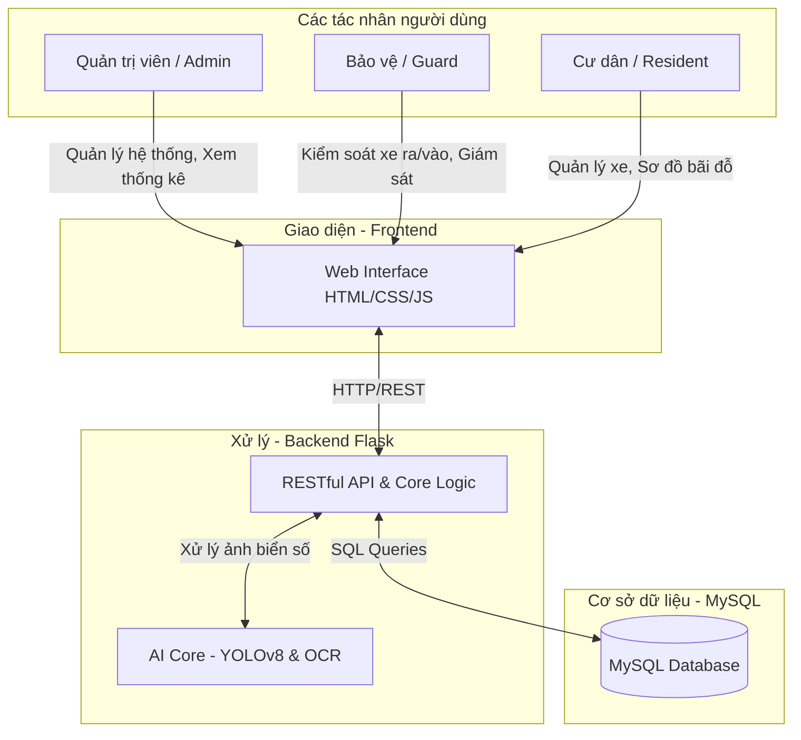

# HỆ THỐNG QUẢN LÝ BÃI ĐỖ XE THÔNG MINH ỨNG DỤNG AI (SMART PARKING)

- **Môn học**: Công nghệ phần mềm (CNPM24)
- **Lớp**: 24CT2
- **Sinh viên thực hiện**: Ông Thân Quốc Trường
- **Trường**: Đại học Kiến trúc Đà Nẵng (DAU) - Khoa Công nghệ thông tin

---

## 🏛️ Kiến Trúc Hệ Thống (System Architecture)



---

## 🏗️ Cấu Trúc Dự Án (Project Structure)

Dự án được tái cấu trúc phân tầng rõ ràng giữa **Frontend**, **Backend**, **Kiểm thử (Tests)** và **Tài liệu (Docs)**:

```text
ongthanquoctruong_24CT2_cnpm/
├── fe/                               # PHÂN HỆ FRONTEND (Giao diện người dùng)
│   ├── templates/                    # Các mẫu giao diện Jinja2 (HTML5 / Bootstrap 5 / Modern CSS)
│   │   ├── index.html                # Bàn trực bảo vệ & Bảng điều khiển quản trị (Admin/Guard)
│   │   ├── login.html                # Giao diện Đăng nhập phân quyền
│   │   ├── register.html             # Đăng ký tài khoản Cư dân trực tuyến
│   │   ├── forgot_password.html      # Yêu cầu đặt lại mật khẩu
│   │   ├── reset_password.html       # Đặt lại mật khẩu mới
│   │   └── resident_dashboard.html   # Cổng dịch vụ Cư dân & Sơ đồ bãi xe Cinema Seat Style
│   ├── static/                       # Tài nguyên tĩnh (CSS, JS, Icons, Images)
│   └── README.md                     # Hướng dẫn chi tiết phân hệ Frontend
│
├── be/                               # PHÂN HỆ BACKEND (Python Flask + AI Core + MySQL)
│   ├── app.py                        # Web Server chính, RESTful APIs, Video Streaming & Auth
│   ├── database.py                   # Module kết nối và truy vấn CSDL MySQL
│   ├── setup_bai_do.py               # Script tự động khởi tạo 100 vị trí đỗ ô tô 2 tầng hầm
│   ├── crnn_ocr_wrapper.py           # Wrapper tương thích EasyOCR / CRNN OCR
│   ├── plate_ocr_inference.py        # Suy luận nhận diện ký tự quang học biển số xe
│   ├── plate_ocr_integration.py      # Cầu nối tích hợp giữa mô hình YOLOv8 và OCR
│   ├── yolov8s.pt                    # Checkpoint YOLOv8 nhận diện biển số
│   ├── artifacts/                    # Mô hình học sâu đã huấn luyện
│   │   └── plate_ocr/
│   │       ├── model.pt              # Trọng số mô hình CRNN-CTC
│   │       └── vocab.json            # Bảng từ điển ký tự biển số Việt Nam
│   ├── sql/                          # Cấu trúc CSDL và Dữ liệu mẫu
│   │   ├── httt_quan_ly_bai_xe_ai.sql# Lược đồ bảng cơ sở dữ liệu hoàn chỉnh
│   │   └── bien_so_xe_sample.sql     # Bộ dữ liệu mẫu biển số & tỉnh thành
│   ├── scripts/                      # Các tiện ích quản trị & huấn luyện AI
│   │   ├── create_database.py        # Khởi tạo CSDL MySQL
│   │   ├── import_data.py            # Nạp dữ liệu ban đầu
│   │   ├── check_database.py         # Kiểm tra tính toàn vẹn CSDL
│   │   ├── check_db.py               # Kiểm tra kết nối nhanh
│   │   ├── generate_ocr_dataset.py   # Sinh tập dữ liệu huấn luyện OCR
│   │   ├── label_ocr_dataset.py      # Gán nhãn dataset
│   │   ├── ocr_train_plate_recognizer.py    # Huấn luyện mô hình CRNN
│   │   ├── ocr_train_plate_recognizer_v2.py # Huấn luyện tối ưu 50 epochs
│   │   ├── ocr_train_quick.py        # Huấn luyện nhanh 3 epochs
│   │   └── prepare_archive_dataset.py# Chuẩn bị dữ liệu từ kho lưu trữ
│   ├── requirements.txt              # Thư viện phụ thuộc Backend
│   ├── .env.example                  # Mẫu biến môi trường CSDL & Secret Key
│   └── README.md                     # Hướng dẫn phân hệ Backend
│
├── tests/                            # BỘ KIỂM THỬ TỰ ĐỘNG (Test Suite)
│   ├── test_cinema_parking.py        # Test Unit & Integration luồng bãi đỗ Cinema (100 ô B1/B2)
│   ├── test_save_plate.py            # Test ghi nhận biển số và lưu trữ CSDL
│   ├── test_get_plates_func.py       # Test truy vấn danh sách xe và trạng thái
│   ├── test_api_simple.py            # Test endpoint REST API
│   ├── test_detection.py             # Test suy luận mô hình AI YOLOv8
│   ├── test_http_request.py          # Test luồng phát video streaming
│   ├── test_30f.jpg                  # Ảnh mẫu biển số ô tô phục vụ test
│   └── README.md                     # Hướng dẫn chạy các kịch bản kiểm thử
│
├── docs/                             # TÀI LIỆU DỰ ÁN & THIẾT KẾ PHẦN MỀM
│   ├── KHAO_SAT_YEU_CAU.md           # Bảng khảo sát yêu cầu chức năng (FR) & phi chức năng (NFR)
│   ├── KHAO_SAT_YEU_CAU_CNPM24.xlsx  # Bảng tính Excel khảo sát chi tiết
│   ├── HE_THONG_VA_LUONG_XU_LY.md    # Đặc tả luồng xử lý toàn diện hệ thống
│   ├── ERD_DIAGRAM.md                # Thiết kế thực thể liên kết CSDL (ERD)
│   ├── USE_CASE_DIAGRAMS.puml        # Biểu đồ Use Case hệ thống (PlantUML)
│   ├── USE_CASE_ACTORS_DETAILED.puml # Phân rã quyền hạn chi tiết từng tác nhân
│   └── export_requirements_excel.py  # Script xuất báo cáo khảo sát ra Excel
│
├── app.py                            # Entrypoint chuyển tiếp khởi chạy toàn hệ thống
├── requirements.txt                  # Danh mục thư viện Python dùng chung
└── .env.example                      # Template cấu hình môi trường
```

---

## 🚀 Hướng Dẫn Cài Đặt & Khởi Chạy

### 1. Kích hoạt Môi trường ảo (Virtual Environment)
```powershell
.venv\Scripts\activate
```

### 2. Cài đặt các thư viện cần thiết
```bash
pip install -r requirements.txt
```

### 3. Cấu hình Cơ sở dữ liệu MySQL
1. Khởi động dịch vụ MySQL (XAMPP / MySQL Community Server).
2. Tạo file `.env` từ `.env.example` và điều chỉnh thông tin:
   ```env
   DB_HOST=localhost
   DB_USER=root
   DB_PASSWORD=your_password
   DB_NAME=HTTT_QuanLyBaiXe_AI
   DB_PORT=3306
   APP_SECRET_KEY=cnpm24-smart-parking-secret-key
   ```
3. Khởi tạo dữ liệu bãi đỗ xe kiểu Cinema:
   ```bash
   python be/setup_bai_do.py
   ```

### 4. Khởi chạy Ứng dụng Web
Bạn có thể khởi chạy server bằng một trong hai cách:
```powershell
# Cách 1: Khởi chạy từ thư mục gốc
python app.py

# Cách 2: Khởi chạy trực tiếp Backend
python be/app.py
```
👉 Truy cập giao diện tại: **http://127.0.0.1:5000**

---

## 🧪 Chạy Kiểm Thử (Run Tests)

Toàn bộ các file kiểm thử được tập trung trong thư mục [`tests/`](file:///d:/CNPM24CT2_OngThanQuocTruong/ongthanquoctruong_24CT2_cnpm/tests):

```powershell
# Chạy toàn bộ test suite
python -m unittest discover -s tests -p "test_*.py"

# Hoặc chạy kiểm thử tính năng cụ thể
python tests/test_cinema_parking.py
python tests/test_save_plate.py
python tests/test_get_plates_func.py
```
