# BÁO CÁO ĐẶC TẢ BIỂU ĐỒ ERD TOÀN DIỆN (ĐẦY ĐỦ TẤT CẢ CÁC BẢNG)
## ĐỀ TÀI: HỆ THỐNG NHẬN DIỆN BIỂN SỐ XE & QUẢN LÝ BÃI XE THÔNG MINH (AI SMART PARKING)

---

### I. MÔ HÌNH THỰC THỂ KẾT HỢP ERD (CHUẨN CHEN THEO SLIDE BÀI GIẢNG)
> **Quy chuẩn hiển thị**:
> - 🟩 **Tập thực thể** (Entity): Hình chữ nhật màu xanh lá.
> - 🔶 **Mối quan hệ** (Relationship): Hình thoi màu đỏ.
> - 🔵 **Thuộc tính** (Attribute): Hình oval màu xanh lam.
> - 🔴 **Khóa chính** (Primary Key): **Có gạch chân ở dưới (`<u>...</u>`)** và viền đỏ nổi bật.
> - **Hỗ trợ trực tiếp trên**: [https://mermaid.live/](https://mermaid.live/)

```mermaid
flowchart TD
    %% =========================================================================
    %% PHÂN HỆ 1: QUẢN LÝ CƯ DÂN, PHƯƠNG TIỆN & BÃI ĐỖ XE
    %% =========================================================================
    subgraph SG_CuDan ["1. PHÂN HỆ CƯ DÂN, PHƯƠNG TIỆN & BÃI ĐỖ XE"]
        %% Thực thể
        CU_DAN["CU_DAN (Cư Dân)"]
        PHUONG_TIEN["PHUONG_TIEN (Phương Tiện)"]
        BAI_DO["BAI_DO (Vị Trí Đỗ Xe Cinema)"]
        CHUYEN_NHUONG["CHUYEN_NHUONG_XE (Đơn Chuyển Nhượng)"]

        %% Mối quan hệ
        REL_SO_HUU{"Sở hữu"}
        REL_DO_TAI{"Đỗ tại"}
        REL_YEU_CAU{"Lập đơn"}
        REL_CHUYEN_XE{"Chuyển giao"}

        %% Thuộc tính Cư dân
        CD_Ma(["<u>MaCuDan</u>"])
        CD_Ten(["HoTen"])
        CD_CCCD(["CCCD"])
        CD_SDT(["SoDienThoai"])
        CD_CanHo(["MaCanHo"])
        CD_NgayDK(["NgayDangKy"])
        CD_TrangThai(["TrangThai"])
        CU_DAN --- CD_Ma
        CU_DAN --- CD_Ten
        CU_DAN --- CD_CCCD
        CU_DAN --- CD_SDT
        CU_DAN --- CD_CanHo
        CU_DAN --- CD_NgayDK
        CU_DAN --- CD_TrangThai

        %% Thuộc tính Phương tiện
        PT_BienSo(["<u>BienSoXe</u>"])
        PT_LoaiXe(["LoaiXe"])
        PT_MauXe(["MauXe"])
        PT_RFID(["MaTheRFID"])
        PT_HanVe(["NgayHetHan"])
        PT_HopLe(["TrangThaiHopLe"])
        PHUONG_TIEN --- PT_BienSo
        PHUONG_TIEN --- PT_LoaiXe
        PHUONG_TIEN --- PT_MauXe
        PHUONG_TIEN --- PT_RFID
        PHUONG_TIEN --- PT_HanVe
        PHUONG_TIEN --- PT_HopLe

        %% Thuộc tính Bãi đỗ xe
        BD_MaVT(["<u>MaViTri</u>"])
        BD_Tang(["TangHam"])
        BD_Day(["DayDo"])
        BD_STT(["SoThuTu"])
        BD_LoaiCho(["LoaiCho"])
        BD_TrangThai(["TrangThai"])
        BAI_DO --- BD_MaVT
        BAI_DO --- BD_Tang
        BAI_DO --- BD_Day
        BAI_DO --- BD_STT
        BAI_DO --- BD_LoaiCho
        BAI_DO --- BD_TrangThai

        %% Thuộc tính Chuyển nhượng
        CN_Ma(["<u>MaChuyenNhuong</u>"])
        CN_NgayTao(["NgayTao"])
        CN_NgayDuyet(["NgayDuyet"])
        CN_TrangThai(["TrangThai"])
        CN_GhiChu(["GhiChu"])
        CHUYEN_NHUONG --- CN_Ma
        CHUYEN_NHUONG --- CN_NgayTao
        CHUYEN_NHUONG --- CN_NgayDuyet
        CHUYEN_NHUONG --- CN_TrangThai
        CHUYEN_NHUONG --- CN_GhiChu

        %% Liên kết nội bộ phân hệ
        CU_DAN ---|1| REL_SO_HUU
        REL_SO_HUU ---|N| PHUONG_TIEN

        PHUONG_TIEN ---|1| REL_DO_TAI
        REL_DO_TAI ---|1| BAI_DO

        CU_DAN ---|1| REL_YEU_CAU
        REL_YEU_CAU ---|N| CHUYEN_NHUONG

        CHUYEN_NHUONG ---|N| REL_CHUYEN_XE
        REL_CHUYEN_XE ---|1| PHUONG_TIEN
    end

    %% =========================================================================
    %% PHÂN HỆ 2: KIỂM SOÁT CỔNG, VÀO RA & THANH TOÁN
    %% =========================================================================
    subgraph SG_KiemSoat ["2. PHÂN HỆ KIỂM SOÁT CỔNG, VÀO RA & THANH TOÁN"]
        %% Thực thể
        LICH_SU_RA_VAO["LICH_SU_RA_VAO (Lượt Ra Vào Bãi)"]
        HOA_DON["HOA_DON (Hóa Đơn Thanh Toán)"]
        BANG_GIA["BANG_GIA (Biểu Phí Thu)"]

        %% Mối quan hệ
        REL_PHAT_SINH{"Phát sinh"}
        REL_XUAT_HD{"Xuất"}
        REL_AP_DUNG{"Áp dụng"}

        %% Thuộc tính Lịch sử ra vào
        LS_MaGD(["<u>MaGiaoDich</u>"])
        LS_TGVao(["ThoiGianVao"])
        LS_AnhVao(["AnhVao"])
        LS_TGRa(["ThoiGianRa"])
        LS_AnhRa(["AnhRa"])
        LS_LoaiKhach(["LoaiKhach"])
        LS_TrangThai(["TrangThai"])
        LICH_SU_RA_VAO --- LS_MaGD
        LICH_SU_RA_VAO --- LS_TGVao
        LICH_SU_RA_VAO --- LS_AnhVao
        LICH_SU_RA_VAO --- LS_TGRa
        LICH_SU_RA_VAO --- LS_AnhRa
        LICH_SU_RA_VAO --- LS_LoaiKhach
        LICH_SU_RA_VAO --- LS_TrangThai

        %% Thuộc tính Hóa đơn
        HD_MaHD(["<u>MaHoaDon</u>"])
        HD_TongTien(["TongTien"])
        HD_TGTT(["ThoiGianThanhToan"])
        HD_PTTT(["PhuongThuc"])
        HD_TrangThai(["TrangThai"])
        HOA_DON --- HD_MaHD
        HOA_DON --- HD_TongTien
        HOA_DON --- HD_TGTT
        HOA_DON --- HD_PTTT
        HOA_DON --- HD_TrangThai

        %% Thuộc tính Bảng giá
        BG_MaGia(["<u>MaGia</u>"])
        BG_LoaiXe(["LoaiXe"])
        BG_LoaiChuXe(["LoaiChuXe"])
        BG_HinhThuc(["HinhThuc"])
        BG_DonGia(["DonGia"])
        BG_NgayApDung(["NgayApDung"])
        BANG_GIA --- BG_MaGia
        BANG_GIA --- BG_LoaiXe
        BANG_GIA --- BG_LoaiChuXe
        BANG_GIA --- BG_HinhThuc
        BANG_GIA --- BG_DonGia
        BANG_GIA --- BG_NgayApDung

        %% Liên kết nội bộ phân hệ
        PHUONG_TIEN ---|1| REL_PHAT_SINH
        REL_PHAT_SINH ---|N| LICH_SU_RA_VAO

        LICH_SU_RA_VAO ---|1| REL_XUAT_HD
        REL_XUAT_HD ---|1| HOA_DON

        BANG_GIA ---|1| REL_AP_DUNG
        REL_AP_DUNG ---|N| HOA_DON
    end

    %% =========================================================================
    %% PHÂN HỆ 3: NHÂN SỰ, TÀI KHOẢN & ĐIỀU HÀNH BỐT GÁC
    %% =========================================================================
    subgraph SG_NhanSu ["3. PHÂN HỆ NHÂN SỰ, TÀI KHOẢN & ĐIỀU HÀNH BỐT GÁC"]
        %% Thực thể
        NHAN_VIEN["NHAN_VIEN (Nhân Sự / Bảo Vệ)"]
        DANG_NHAP["LICH_SU_DANG_NHAP (Phiên Trực)"]

        %% Mối quan hệ
        REL_DANG_NHAP{"Ghi phiên"}
        REL_KIEM_SOAT{"Xác nhận vào/ra"}
        REL_THU_TIEN{"Thu cước"}

        %% Thuộc tính Nhân viên
        NV_MaNV(["<u>MaNV</u>"])
        NV_HoTen(["HoTen"])
        NV_VaiTro(["VaiTro"])
        NV_TrangThai(["TrangThai"])
        NHAN_VIEN --- NV_MaNV
        NHAN_VIEN --- NV_HoTen
        NHAN_VIEN --- NV_VaiTro
        NHAN_VIEN --- NV_TrangThai

        %% Thực thể Tài Khoản Hệ Thống
        APP_USERS["APP_USERS (Tài Khoản App)"]
        AU_ID(["<u>id</u>"])
        AU_Phone(["SoDienThoai (Login)"])
        AU_Pass(["MatKhauHash"])
        AU_Role(["VaiTro"])
        APP_USERS --- AU_ID
        APP_USERS --- AU_Phone
        APP_USERS --- AU_Pass
        APP_USERS --- AU_Role

        %% Thuộc tính Phiên đăng nhập
        DN_MaPhien(["<u>MaPhien</u>"])
        DN_TGVao(["ThoiGianDangNhap"])
        DN_TGRa(["ThoiGianDangXuat"])
        DN_IP(["DiaChiIP"])
        DN_TrangThai(["TrangThai"])
        DANG_NHAP --- DN_MaPhien
        DANG_NHAP --- DN_TGVao
        DANG_NHAP --- DN_TGRa
        DANG_NHAP --- DN_IP
        DANG_NHAP --- DN_TrangThai

        %% Liên kết nhân sự
        NHAN_VIEN ---|1| REL_DANG_NHAP
        REL_DANG_NHAP ---|N| DANG_NHAP

        NHAN_VIEN ---|1| REL_KIEM_SOAT
        REL_KIEM_SOAT ---|N| LICH_SU_RA_VAO

        NHAN_VIEN ---|1| REL_THU_TIEN
        REL_THU_TIEN ---|N| HOA_DON
    end

    %% =========================================================================
    %% PHÂN HỆ 4: THỊ GIÁC MÁY TÍNH AI & THỐNG KÊ CAMERA
    %% =========================================================================
    subgraph SG_AI ["4. PHÂN HỆ THỊ GIÁC MÁY TÍNH AI & THỐNG KÊ CAMERA"]
        %% Thực thể
        PLATES["PLATES (Biển Số Quét Được)"]
        DETECTIONS["DETECTIONS (Khung Hình AI)"]
        PARKING_SESSIONS["PARKING_SESSIONS (Phiên Xe AI)"]
        STATISTICS["STATISTICS (Thống Kê Ngày)"]

        %% Mối quan hệ
        REL_CHI_TIET{"Ghi nhận"}
        REL_PHIEN_AI{"Tạo phiên"}
        REL_DONG_BO{"Đồng bộ"}

        %% Thuộc tính Plates
        PL_Id(["<u>id</u>"])
        PL_Text(["plate_text"])
        PL_Count(["detection_count"])
        PL_Conf(["confidence"])
        PL_Last(["last_detected"])
        PLATES --- PL_Id
        PLATES --- PL_Text
        PLATES --- PL_Count
        PLATES --- PL_Conf
        PLATES --- PL_Last

        %% Thuộc tính Detections
        DT_Id(["<u>id</u>"])
        DT_Time(["detected_at"])
        DT_Conf(["confidence"])
        DT_Cam(["camera_source"])
        DT_Frame(["frame_number"])
        DT_Raw(["raw_text"])
        DETECTIONS --- DT_Id
        DETECTIONS --- DT_Time
        DETECTIONS --- DT_Conf
        DETECTIONS --- DT_Cam
        DETECTIONS --- DT_Frame
        DETECTIONS --- DT_Raw

        %% Thuộc tính Parking Sessions
        PS_Id(["<u>id</u>"])
        PS_Plate(["plate_text"])
        PS_In(["check_in_time"])
        PS_Out(["check_out_time"])
        PS_Duration(["duration_minutes"])
        PS_Fee(["fee"])
        PS_Status(["status"])
        PARKING_SESSIONS --- PS_Id
        PARKING_SESSIONS --- PS_Plate
        PARKING_SESSIONS --- PS_In
        PARKING_SESSIONS --- PS_Out
        PARKING_SESSIONS --- PS_Duration
        PARKING_SESSIONS --- PS_Fee
        PARKING_SESSIONS --- PS_Status

        %% Thuộc tính Statistics
        ST_Id(["<u>id</u>"])
        ST_Date(["date_stat"])
        ST_Plates(["total_plates"])
        ST_Detections(["total_detections"])
        ST_AvgConf(["avg_confidence"])
        STATISTICS --- ST_Id
        STATISTICS --- ST_Date
        STATISTICS --- ST_Plates
        STATISTICS --- ST_Detections
        STATISTICS --- ST_AvgConf

        %% Liên kết AI
        PLATES ---|1| REL_CHI_TIET
        REL_CHI_TIET ---|N| DETECTIONS

        PLATES ---|1| REL_PHIEN_AI
        REL_PHIEN_AI ---|N| PARKING_SESSIONS

        PARKING_SESSIONS ---|1| REL_DONG_BO
        REL_DONG_BO ---|1| LICH_SU_RA_VAO
    end

    %% =========================================================================
    %% ĐỊNH NGHĨA PHONG CÁCH MÀU SẮC CHUẨN SLIDE
    %% =========================================================================
    classDef entity fill:#86efac,stroke:#16a34a,stroke-width:2.5px,color:#064e3b,font-weight:bold;
    classDef relation fill:#f87171,stroke:#dc2626,stroke-width:2px,color:#ffffff,font-weight:bold;
    classDef attribute fill:#93c5fd,stroke:#2563eb,stroke-width:1.5px,color:#1e3a8a;
    classDef keyAttr fill:#bfdbfe,stroke:#dc2626,stroke-width:3px,color:#1e3a8a,font-weight:bold;

    class CU_DAN,PHUONG_TIEN,BAI_DO,CHUYEN_NHUONG,LICH_SU_RA_VAO,HOA_DON,BANG_GIA,NHAN_VIEN,DANG_NHAP,PLATES,DETECTIONS,PARKING_SESSIONS,STATISTICS entity;
    class REL_SO_HUU,REL_DO_TAI,REL_YEU_CAU,REL_CHUYEN_XE,REL_PHAT_SINH,REL_XUAT_HD,REL_AP_DUNG,REL_DANG_NHAP,REL_KIEM_SOAT,REL_THU_TIEN,REL_CHI_TIET,REL_PHIEN_AI,REL_DONG_BO relation;
    
    class CD_Ten,CD_CCCD,CD_SDT,CD_CanHo,CD_NgayDK,CD_TrangThai,PT_LoaiXe,PT_MauXe,PT_RFID,PT_HanVe,PT_HopLe,BD_Tang,BD_Day,BD_STT,BD_LoaiCho,BD_TrangThai,CN_NgayTao,CN_NgayDuyet,CN_TrangThai,CN_GhiChu,LS_TGVao,LS_AnhVao,LS_TGRa,LS_AnhRa,LS_LoaiKhach,LS_TrangThai,HD_TongTien,HD_TGTT,HD_PTTT,HD_TrangThai,BG_LoaiXe,BG_LoaiChuXe,BG_HinhThuc,BG_DonGia,BG_NgayApDung,NV_HoTen,NV_TaiKhoan,NV_MatKhau,NV_VaiTro,NV_TrangThai,DN_TGVao,DN_TGRa,DN_IP,DN_TrangThai,PL_Text,PL_Count,PL_Conf,PL_Last,DT_Time,DT_Conf,DT_Cam,DT_Frame,DT_Raw,PS_Plate,PS_In,PS_Out,PS_Duration,PS_Fee,PS_Status,ST_Date,ST_Plates,ST_Detections,ST_AvgConf attribute;
    
    class CD_Ma,PT_BienSo,BD_MaVT,CN_Ma,LS_MaGD,HD_MaHD,BG_MaGia,NV_MaNV,DN_MaPhien,PL_Id,DT_Id,PS_Id,ST_Id keyAttr;
```

---

### II. BẢNG TỔNG HỢP TOÀN BỘ 13 BẢNG & TRƯỜNG KHÓA CHÍNH (PRIMARY KEY)

| STT | Tên Bảng Thực Thể | Ý Nghĩa Nghiệp Vụ | Trường Khóa Chính (Primary Key - Gạch chân) | Thuộc Tính Đi Kèm |
| :---: | :--- | :--- | :--- | :--- |
| **1** | `CU_DAN` | Thông tin cư dân chung cư | `<u>MaCuDan</u>` | HoTen, CCCD, SoDienThoai, MaCanHo, NgayDangKy, TrangThai |
| **2** | `PHUONG_TIEN` | Danh sách phương tiện đăng ký | `<u>BienSoXe</u>` | LoaiXe, MauXe, MaTheRFID, NgayHetHan, TrangThaiHopLe |
| **3** | `BAI_DO` | Sơ đồ bãi đỗ xe Cinema 100 ô | `<u>MaViTri</u>` | TangHam, DayDo, SoThuTu, LoaiCho (VIP/Normal), TrangThai |
| **4** | `CHUYEN_NHUONG_XE` | Đơn xin sang nhượng quyền xe | `<u>MaChuyenNhuong</u>` | NgayTao, NgayDuyet, TrangThai, GhiChu |
| **5** | `LICH_SU_RA_VAO` | Nhật ký các lượt xe ra vào cổng | `<u>MaGiaoDich</u>` | ThoiGianVao, AnhVao, ThoiGianRa, AnhRa, LoaiKhach, TrangThai |
| **6** | `HOA_DON` | Hóa đơn thu cước phí gửi xe | `<u>MaHoaDon</u>` | TongTien, ThoiGianThanhToan, PhuongThucThanhToan, TrangThai |
| **7** | `BANG_GIA` | Biểu phí đỗ xe theo lượt/tháng | `<u>MaGia</u>` | LoaiXe, LoaiChuXe, HinhThuc, DonGia, NgayApDung |
| **8** | `NHAN_VIEN` | Cán bộ quản lý & bảo vệ bốt gác | `<u>MaNV</u>` | HoTen, TaiKhoan, MatKhau, VaiTro, TrangThai |
| **9** | `LICH_SU_DANG_NHAP` | Nhật ký phiên làm việc của nhân sự | `<u>MaPhien</u>` | ThoiGianDangNhap, ThoiGianDangXuat, DiaChiIP, TrangThai |
| **10** | `PLATES` | Danh bạ biển số nhận diện từ AI | `<u>id</u>` | plate_text, detection_count, confidence, last_detected |
| **11** | `DETECTIONS` | Lịch sử chụp và phát hiện khung hình | `<u>id</u>` | detected_at, confidence, camera_source, frame_number, raw_text |
| **12** | `PARKING_SESSIONS` | Phiên giao dịch xe AI thời gian thực | `<u>id</u>` | plate_text, check_in_time, check_out_time, duration_minutes, fee, status |
| **13** | `STATISTICS` | Thống kê tổng hợp vận hành theo ngày | `<u>id</u>` | date_stat, total_plates, total_detections, avg_confidence |
