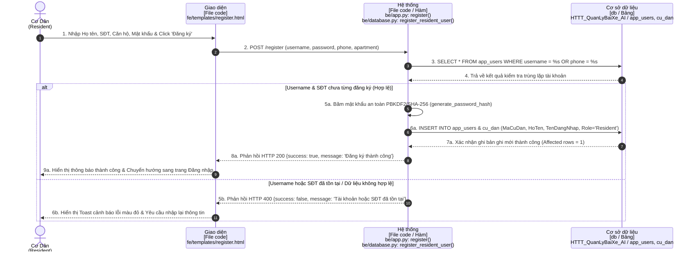
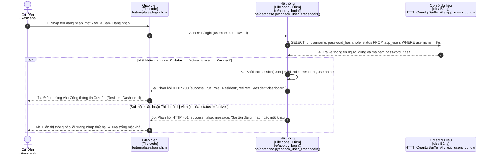
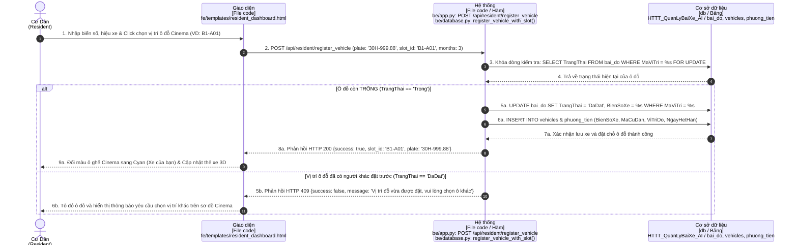
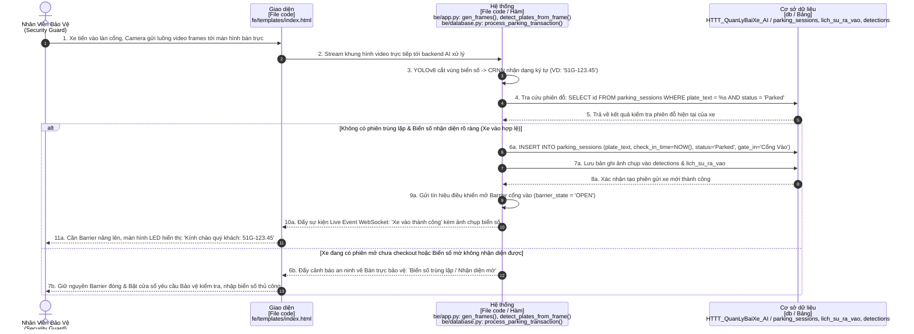
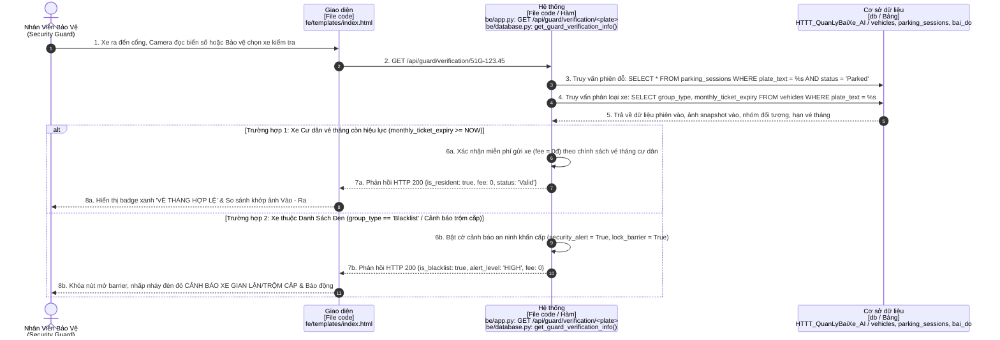
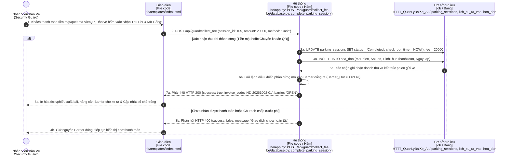
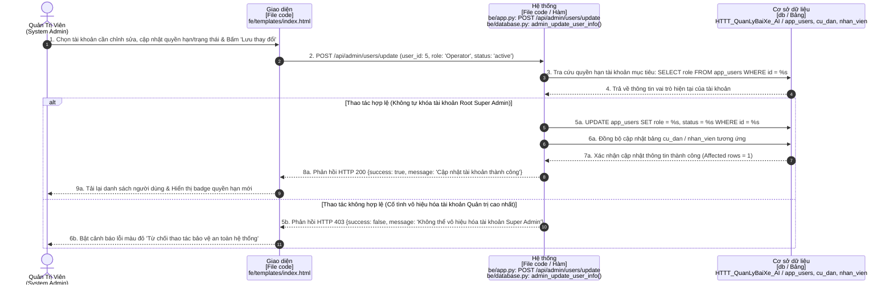
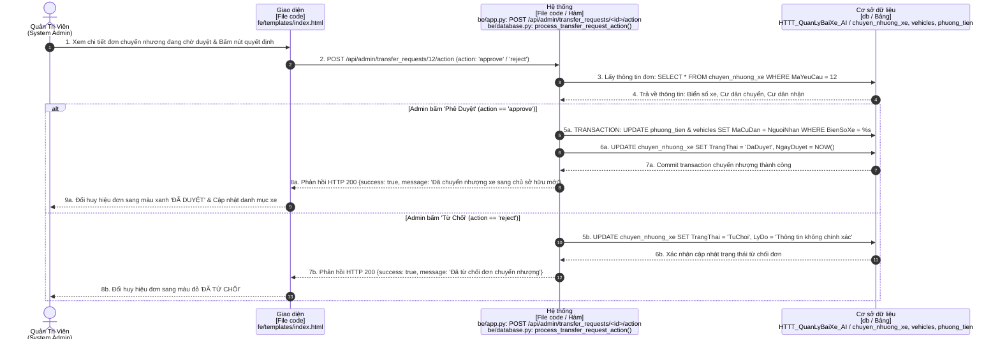
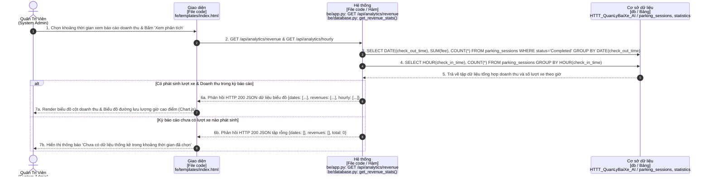

# BÁO CÁO PHÂN TÍCH YÊU CẦU: SƠ ĐỒ TUẦN TỰ (SEQUENCE DIAGRAMS)
## HỆ THỐNG NHẬN DIỆN BIỂN SỐ & QUẢN LÝ BÃI ĐỖ XE THÔNG MINH AI (SMART PARKING)

- **Môn học**: Công nghệ phần mềm (CNPM24)
- **Lớp**: 24CT2
- **Sinh viên thực hiện**: Ông Thân Quốc Trường
- **Trường**: Đại học Kiến trúc Đà Nẵng (DAU) - Khoa Công nghệ thông tin

---

## 📌 QUY CHUẨN THIẾT KẾ THEO YÊU CẦU MỚI CỦA GIẢNG VIÊN

Toàn bộ sơ đồ tuần tự được thiết kế tuân thủ 100% hướng dẫn bài giảng trên lớp và quy chuẩn UML chuẩn hóa:

| Cột (Lifeline) | Hình thức thể hiện | Quy định bài giảng | Ánh xạ chi tiết trong mã nguồn đồ án |
| :--- | :--- | :--- | :--- |
| **1. Tác nhân (Actor)** | **Hình con người (UML Actor stick figure)**, tên ghi ở dưới | `Khách hàng / Tác nhân` | Phân theo 3 vai trò: **Cư Dân**, **Nhân Viên Bảo Vệ**, **Quản Trị Viên** |
| **2. Giao diện (Boundary)** | Khối chữ nhật màu vàng (`#FEF3C7`) | **`[File code]`** | Đường dẫn chính xác file giao diện (`fe/templates/login.html`, `resident_dashboard.html`,...) |
| **3. Hệ thống (Control)** | Khối chữ nhật màu tím lam (`#E0E7FF`) | **`[File code / Hàm]`** | Đường dẫn file backend & Tên hàm (`be/app.py: ...`, `be/database.py: ...`) |
| **4. Cơ sở dữ liệu (Entity)** | Khối chữ nhật màu tím (`#F3E8FF`) | **`[db / Bảng]`** | Tên CSDL (`HTTT_QuanLyBaiXe_AI`) & Danh sách các bảng dữ liệu tác động |

### ⚡ Quy chuẩn khung rẽ nhánh `alt` (UML Alternative Combined Fragment):
- Mọi điều kiện kiểm tra (if/else) được bao bọc trong **Khung `alt`** với viền nét đứt (`dashed=1`).
- **Nửa trên**: Trường hợp hợp lệ / thành công (`[Happy Path]`).
- **Vạch ngăn cách nét đứt**: Nhãn **`[else: Điều kiện không hợp lệ / Thất bại / Cảnh báo]`**.
- **Nửa dưới**: Các bước xử lý ngoại lệ (mã lỗi HTTP 400/401/403/409, cảnh báo an ninh, thông báo Toast màu đỏ đến người dùng).

---

## 📂 DANH MỤC FILE DRAW.IO ĐÃ TẠO

Các file Draw.io đã sẵn sàng để mở trực tiếp trên [app.diagrams.net](https://app.diagrams.net):

1. **File Master (Tổng hợp 13 Use Cases trong 1 file, chia thành 13 Tab riêng biệt)**:
   - 📄 [`docs/SO_DO_TUAN_TU_HE_THONG.drawio`](file:///d:/CNPM24CT2_OngThanQuocTruong/ongthanquoctruong_24CT2_cnpm/docs/SO_DO_TUAN_TU_HE_THONG.drawio)
2. **Thư mục 13 file riêng lẻ theo từng Tác nhân & Chức năng**:
   - 📁 [`docs/drawio/`](file:///d:/CNPM24CT2_OngThanQuocTruong/ongthanquoctruong_24CT2_cnpm/docs/drawio)
     - **Nhóm Cư Dân**:
       - `uc01_resident_register.drawio`
       - `uc02_resident_login.drawio`
       - `uc03_resident_register_vehicle.drawio`
       - `uc04_resident_change_slot.drawio`
       - `uc05_resident_renew_pass.drawio`
       - `uc06_resident_transfer_request.drawio`
       - `uc07_resident_history.drawio`
     - **Nhóm Nhân Viên Bảo Vệ**:
       - `uc08_guard_auto_checkin.drawio`
       - `uc09_guard_checkout_verification.drawio`
       - `uc10_guard_collect_fee_barrier.drawio`
     - **Nhóm Quản Trị Viên (Admin)**:
       - `uc11_admin_user_mgmt.drawio`
       - `uc12_admin_approve_transfer.drawio`
       - `uc13_admin_analytics.drawio`
3. **Mã Nguồn PlantUML**:
   - 📄 [`docs/SEQUENCE_DIAGRAMS.puml`](file:///d:/CNPM24CT2_OngThanQuocTruong/ongthanquoctruong_24CT2_cnpm/docs/SEQUENCE_DIAGRAMS.puml)
4. **Script Sinh Tự Động Draw.io XML**:
   - 🐍 [`docs/generate_sequence_drawio.py`](file:///d:/CNPM24CT2_OngThanQuocTruong/ongthanquoctruong_24CT2_cnpm/docs/generate_sequence_drawio.py)

---

## 📊 BẢNG TỔNG HỢP ÁNH XẠ CODE THEO TỪNG TÁC NHÂN (13 SƠ ĐỒ)

### 👤 NHÓM 1: TÁC NHÂN CƯ DÂN (RESIDENT)

| Mã UC | Chức Năng Chi Tiết | Giao Diện `[File code]` | Hệ Thống `[File code / Hàm]` | CSDL `[db / Bảng]` | Điều Kiện `alt` / `else` |
| :---: | :--- | :--- | :--- | :--- | :--- |
| **UC01** | Đăng ký tài khoản cư dân | `fe/templates/register.html` | `be/app.py: register()` `be/database.py: register_resident_user()` | `HTTT_QuanLyBaiXe_AI /` `app_users, cu_dan` | `alt`: SĐT chưa đăng ký (Tạo user 200) `else`: SĐT đã tồn tại (Lỗi 400) |
| **UC02** | Đăng nhập cư dân | `fe/templates/login.html` | `be/app.py: login()` `be/database.py: check_user_credentials()` | `HTTT_QuanLyBaiXe_AI /` `app_users, cu_dan` | `alt`: Đúng pass & active (Vào Dashboard) `else`: Sai pass/khóa (Báo lỗi 401) |
| **UC03** | Đăng ký xe & Chọn ô Cinema | `fe/templates/resident_dashboard.html` *(Modal `#cinemaModal`)* | `be/app.py: POST /api/resident/register_vehicle` `be/database.py: register_vehicle_with_slot()` | `HTTT_QuanLyBaiXe_AI /` `bai_do, vehicles, phuong_tien` | `alt`: Ô còn 'Trong' (Cấp ô, đổi màu Cyan) `else`: Ô đã 'DaDat' (Báo lỗi 409) |
| **UC04** | Đổi vị trí đỗ xe Cinema | `fe/templates/resident_dashboard.html` *(Modal `#changeSlotModal`)* | `be/app.py: POST /api/parking/change_slot` `be/database.py: change_vehicle_parking_slot()` | `HTTT_QuanLyBaiXe_AI /` `bai_do, vehicles, phuong_tien` | `alt`: Ô mới 'Trong' (Giải phóng ô cũ & cấp mới) `else`: Ô mới bận (Rollback transaction) |
| **UC05** | Gia hạn vé tháng cư dân | `fe/templates/resident_dashboard.html` *(Modal `#renewTicketModal`)* | `be/app.py: POST /api/resident/renew_ticket` `be/database.py: renew_monthly_ticket()` | `HTTT_QuanLyBaiXe_AI /` `vehicles, phuong_tien, lich_su_thanh_toan` | `alt`: Xe hợp lệ (Cộng hạn mới, lưu thanh toán) `else`: Không tìm thấy xe (Báo lỗi 404) |
| **UC06** | Yêu cầu chuyển nhượng xe | `fe/templates/resident_dashboard.html` *(Modal `#transferVehicleModal`)* | `be/app.py: POST /api/resident/transfer_vehicle` `be/database.py: create_vehicle_transfer_request()` | `HTTT_QuanLyBaiXe_AI /` `chuyen_nhuong_xe, cu_dan, vehicles` | `alt`: Tìm thấy cư dân nhận (Lập đơn Chờ duyệt) `else`: SĐT không tồn tại (Báo lỗi 400) |
| **UC07** | Tra cứu lịch sử xe vào/ra | `fe/templates/resident_dashboard.html` *(Bảng `#historySection`)* | `be/app.py: GET /api/resident/history` `be/database.py: get_resident_vehicle_history()` | `HTTT_QuanLyBaiXe_AI /` `parking_sessions, lich_su_ra_vao` | `alt`: Có lịch sử (Render bảng & ảnh snapshot) `else`: Không có dữ liệu (Thông báo rỗng) |

---

### 🛡️ NHÓM 2: TÁC NHÂN NHÂN VIÊN BẢO VỆ (SECURITY GUARD / OPERATOR)

| Mã UC | Chức Năng Chi Tiết | Giao Diện `[File code]` | Hệ Thống `[File code / Hàm]` | CSDL `[db / Bảng]` | Điều Kiện `alt` / `else` |
| :---: | :--- | :--- | :--- | :--- | :--- |
| **UC08** | AI Check-in xe vào tự động | `fe/templates/index.html` *(Tab `#recognition-page`, Camera Live)* | `be/app.py: gen_frames(), detect_plates_from_frame()` `be/database.py: process_parking_transaction()` | `HTTT_QuanLyBaiXe_AI /` `parking_sessions, detections, lich_su_ra_vao` | `alt`: Nhận diện rõ & không trùng phiên (Mở Barrier) `else`: Phiên trùng/biển mờ (Báo động, giữ barrier) |
| **UC09** | Đối chiếu ra & Blacklist | `fe/templates/index.html` *(Bàn trực `#guard-station-page`)* | `be/app.py: GET /api/guard/verification/<plate>` `be/database.py: get_guard_verification_info()` | `HTTT_QuanLyBaiXe_AI /` `vehicles, parking_sessions, bai_do` | `alt`: Vé tháng còn hạn (Fee = 0đ, khớp ảnh) `else`: Xe Blacklist (Khóa barrier, còi báo động) |
| **UC10** | Thu phí & Mở Barrier cổng ra | `fe/templates/index.html` *(`#guardFeeBox`, `#guardConfirmActionBtn`)* | `be/app.py: POST /api/guard/collect_fee` `be/database.py: complete_parking_session()` | `HTTT_QuanLyBaiXe_AI /` `parking_sessions, lich_su_ra_vao, hoa_don` | `alt`: Đã thu tiền (In hóa đơn, mở Barrier ra) `else`: Chưa thanh toán (Giữ nguyên Barrier đóng) |

---

### ⚙️ NHÓM 3: TÁC NHÂN QUẢN TRỊ VIÊN (SYSTEM ADMIN)

| Mã UC | Chức Năng Chi Tiết | Giao Diện `[File code]` | Hệ Thống `[File code / Hàm]` | CSDL `[db / Bảng]` | Điều Kiện `alt` / `else` |
| :---: | :--- | :--- | :--- | :--- | :--- |
| **UC11** | Quản lý người dùng & Phân quyền | `fe/templates/index.html` *(Tab `#users-page`, `#editUserModal`)* | `be/app.py: POST /api/admin/users/update` `be/database.py: admin_update_user_info()` | `HTTT_QuanLyBaiXe_AI /` `app_users, cu_dan, nhan_vien` | `alt`: Thao tác hợp lệ (Cập nhật role/status 200) `else`: Khóa Super Admin (Từ chối lỗi 403) |
| **UC12** | Phê duyệt đơn chuyển nhượng | `fe/templates/index.html` *(Tab `#transfers-page`)* | `be/app.py: POST /api/admin/transfer_requests/<id>/action` `be/database.py: process_transfer_request_action()` | `HTTT_QuanLyBaiXe_AI /` `chuyen_nhuong_xe, vehicles, phuong_tien` | `alt`: Bấm 'Duyệt' (Đổi chủ xe sang người nhận) `else`: Bấm 'Từ chối' (Đổi trạng thái đơn TuChoi) |
| **UC13** | Báo cáo thống kê & Doanh thu | `fe/templates/index.html` *(Tab `#reports-page`, `renderCharts`)* | `be/app.py: GET /api/analytics/revenue` `be/database.py: get_revenue_stats()` | `HTTT_QuanLyBaiXe_AI /` `parking_sessions, statistics` | `alt`: Có giao dịch (Vẽ biểu đồ doanh thu & giờ) `else`: Không có giao dịch (Hiển thị biểu đồ 0) |

---

## 📝 CHI TIẾT SƠ ĐỒ TUẦN TỰ KÈM KHUNG ALT (MERMAID)

### 1. UC01 - Đăng Ký Tài Khoản Cư Dân (Tác nhân: Cư Dân)

---

### 2. UC02 - Đăng Nhập Cư Dân (Tác nhân: Cư Dân)

---

### 3. UC03 - Đăng Ký Xe & Chọn Ô Đỗ Cinema (Tác nhân: Cư Dân)

---

### 4. UC08 - AI Check-in Xe Vào Cổng (Tác nhân: Nhân Viên Bảo Vệ & Camera Cổng)

---

### 5. UC09 - Đối Chiếu Xe Ra & Cảnh Báo Blacklist (Tác nhân: Nhân Viên Bảo Vệ)

---

### 6. UC10 - Thu Phí Gửi Xe & Mở Barrier Cổng Ra (Tác nhân: Nhân Viên Bảo Vệ)

---

### 7. UC11 - Quản Lý Người Dùng & Phân Quyền (Tác nhân: Quản Trị Viên)

---

### 8. UC12 - Phê Duyệt Đơn Chuyển Nhượng Xe (Tác nhân: Quản Trị Viên)

---

### 9. UC13 - Báo Cáo Thống Kê & Doanh Thu (Tác nhân: Quản Trị Viên)

