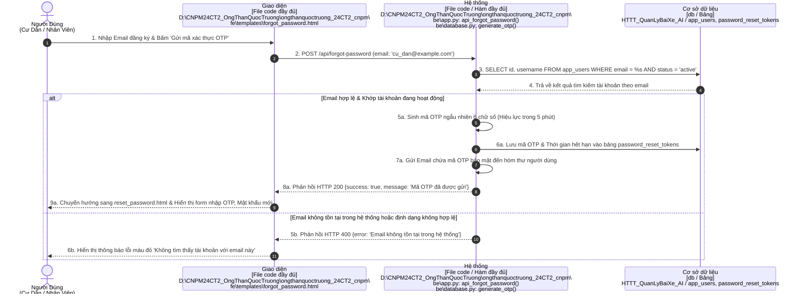

# BÁO CÁO PHÂN TÍCH YÊU CẦU: SƠ ĐỒ TUẦN TỰ (SEQUENCE DIAGRAMS)
## HỆ THỐNG NHẬN DIỆN BIỂN SỐ & QUẢN LÝ BÃI ĐỖ XE THÔNG MINH AI (SMART PARKING)

- **Môn học**: Công nghệ phần mềm (CNPM24)
- **Lớp**: 24CT2
- **Sinh viên thực hiện**: Ông Thân Quốc Trường
- **Trường**: Đại học Kiến trúc Đà Nẵng (DAU) - Khoa Công nghệ thông tin

---

## 📌 QUY CHUẨN THIẾT KẾ THEO YÊU CẦU CỦA GIẢNG VIÊN

Toàn bộ sơ đồ tuần tự được thiết kế tuân thủ 100% hướng dẫn bài giảng trên lớp và quy chuẩn UML chuẩn hóa:

| Cột (Lifeline) | Hình thức thể hiện | Quy định bài giảng | Ánh xạ chi tiết trong mã nguồn đồ án (ĐƯỜNG DẪN ĐẦY ĐỦ) |
| :--- | :--- | :--- | :--- |
| **1. Tác nhân (Actor)** | **Hình con người (UML Actor stick figure)**, tên ghi ở dưới | `Khách hàng / Tác nhân` | Phân theo vai trò: **Cư Dân**, **Người Dùng**, **Nhân Viên Bảo Vệ**, **Quản Trị Viên** |
| **2. Giao diện (Boundary)** | Khối chữ nhật màu vàng (`#FEF3C7`) | **`[File code]`** | **Đường dẫn tuyệt đối đầy đủ đến file frontend**: `D:\CNPM24CT2_OngThanQuocTruong\ongthanquoctruong_24CT2_cnpm\fe\templates\...` |
| **3. Hệ thống (Control)** | Khối chữ nhật màu tím lam (`#E0E7FF`) | **`[File code / Hàm]`** | **Đường dẫn tuyệt đối đầy đủ đến file backend & Tên hàm**: `D:\CNPM24CT2_OngThanQuocTruong\ongthanquoctruong_24CT2_cnpm\be\app.py: ...` |
| **4. Cơ sở dữ liệu (Entity)** | Khối chữ nhật màu tím (`#F3E8FF`) | **`[db / Bảng]`** | Tên CSDL (`HTTT_QuanLyBaiXe_AI`) & Danh sách các bảng dữ liệu tác động |

### ⚡ Quy chuẩn khung rẽ nhánh `alt` (UML Alternative Combined Fragment):
- Mọi điều kiện kiểm tra (if/else) được bao bọc trong **Khung `alt`** với viền nét đứt (`dashed=1`).
- **Nửa trên**: Trường hợp hợp lệ / thành công (`[Happy Path]`).
- **Vạch ngăn cách nét đứt**: Nhãn **`[else: Điều kiện không hợp lệ / Thất bại / Cảnh báo]`**.
- **Nửa dưới**: Các bước xử lý ngoại lệ (mã lỗi HTTP 400/401/403/409, cảnh báo đỏ, giữ Barrier đóng,...).

---

## 📂 DANH MỤC FILE DRAW.IO ĐÃ TẠO

Các file Draw.io đã sẵn sàng để mở trực tiếp trên [app.diagrams.net](https://app.diagrams.net):

1. **File Master (Tổng hợp toàn bộ các Use Case trong 1 file, chia thành các Tab có gắn nhãn nhóm Tác nhân)**:
   - 📄 [`docs/SO_DO_TUAN_TU_HE_THONG.drawio`](file:///d:/CNPM24CT2_OngThanQuocTruong/ongthanquoctruong_24CT2_cnpm/docs/SO_DO_TUAN_TU_HE_THONG.drawio)
2. **Thư mục 14 file riêng lẻ theo từng Tác nhân & Chức năng**:
   - 📁 [`docs/drawio/`](file:///d:/CNPM24CT2_OngThanQuocTruong/ongthanquoctruong_24CT2_cnpm/docs/drawio)
     - **Nhóm Cư Dân & Người Dùng**:
       - `uc01_resident_register.drawio` (Đăng ký tài khoản cư dân)
       - `uc02_resident_login.drawio` (Đăng nhập cư dân)
       - `uc02b_forgot_password.drawio` (**Quên mật khẩu & Xác thực OTP**)
       - `uc03_resident_register_vehicle.drawio` (Đăng ký xe & Chọn ô đỗ Cinema)
       - `uc04_resident_change_slot.drawio` (Đổi vị trí đỗ xe Cinema)
       - `uc05_resident_renew_pass.drawio` (Gia hạn vé tháng cư dân)
       - `uc06_resident_transfer_request.drawio` (Yêu cầu chuyển nhượng xe & ô đỗ)
       - `uc07_resident_history.drawio` (Tra cứu lịch sử xe vào/ra)
     - **Nhóm Nhân Viên Bảo Vệ**:
       - `uc08_guard_auto_checkin.drawio` (Nhận diện AI & Tự động Check-in xe vào)
       - `uc09_guard_checkout_verification.drawio` (Đối chiếu xe ra & Cảnh báo Blacklist)
       - `uc10_guard_collect_fee_barrier.drawio` (Thu phí & Mở Barrier cổng ra)
     - **Nhóm Quản Trị Viên (Admin)**:
       - `uc11_admin_user_mgmt.drawio` (Quản lý tài khoản người dùng & Phân quyền)
       - `uc12_admin_approve_transfer.drawio` (Phê duyệt đơn chuyển nhượng)
       - `uc13_admin_analytics.drawio` (Báo cáo thống kê & Biểu đồ doanh thu)
3. **Mã Nguồn PlantUML**:
   - 📄 [`docs/SEQUENCE_DIAGRAMS.puml`](file:///d:/CNPM24CT2_OngThanQuocTruong/ongthanquoctruong_24CT2_cnpm/docs/SEQUENCE_DIAGRAMS.puml)
4. **Script Sinh Tự Động Draw.io XML**:
   - 🐍 [`docs/generate_sequence_drawio.py`](file:///d:/CNPM24CT2_OngThanQuocTruong/ongthanquoctruong_24CT2_cnpm/docs/generate_sequence_drawio.py)

---

## 📊 BẢNG TỔNG HỢP ÁNH XẠ CODE THEO ĐƯỜNG DẪN ĐẦY ĐỦ

### 👤 NHÓM 1: TÁC NHÂN CƯ DÂN & NGƯỜI DÙNG (RESIDENT / APP USERS)

| Mã UC | Chức Năng Chi Tiết | Giao Diện `[File code đầy đủ]` | Hệ Thống `[File code / Hàm đầy đủ]` | CSDL `[db / Bảng]` | Điều Kiện Rẽ Nhánh Khung `alt` |
| :---: | :--- | :--- | :--- | :--- | :--- |
| **UC01** | Đăng ký tài khoản cư dân | `D:\CNPM24CT2_OngThanQuocTruong\ongthanquoctruong_24CT2_cnpm\` `fe\templates\register.html` | `D:\CNPM24CT2_OngThanQuocTruong\ongthanquoctruong_24CT2_cnpm\` `be\app.py: register()` `be\database.py: register_resident_user()` | `HTTT_QuanLyBaiXe_AI /` `app_users, cu_dan` | **`alt`**: SĐT chưa đăng ký (Băm pass, tạo user 200) **`else`**: SĐT/User đã tồn tại (Báo lỗi đỏ 400) |
| **UC02** | Đăng nhập cư dân | `D:\CNPM24CT2_OngThanQuocTruong\ongthanquoctruong_24CT2_cnpm\` `fe\templates\login.html` | `D:\CNPM24CT2_OngThanQuocTruong\ongthanquoctruong_24CT2_cnpm\` `be\app.py: login()` `be\database.py: check_user_credentials()` | `HTTT_QuanLyBaiXe_AI /` `app_users, cu_dan` | **`alt`**: Đúng pass & active (Vào Resident Dashboard) **`else`**: Sai pass/tài khoản khóa (Báo lỗi 401) |
| **UC02b** | Quên mật khẩu & OTP | `D:\CNPM24CT2_OngThanQuocTruong\ongthanquoctruong_24CT2_cnpm\` `fe\templates\forgot_password.html` *(kèm `reset_password.html`)* | `D:\CNPM24CT2_OngThanQuocTruong\ongthanquoctruong_24CT2_cnpm\` `be\app.py: api_forgot_password(), api_reset_password()` `be\database.py: generate_otp(), verify_and_reset_password()` | `HTTT_QuanLyBaiXe_AI /` `app_users, password_reset_tokens` | **`alt`**: Email tồn tại (Gửi mã OTP 6 số, chuyển reset 200) **`else`**: Email không tồn tại trong hệ thống (Báo lỗi 400) |
| **UC03** | Đăng ký xe & Chọn ô Cinema | `D:\CNPM24CT2_OngThanQuocTruong\ongthanquoctruong_24CT2_cnpm\` `fe\templates\resident_dashboard.html` *(Modal `#cinemaModal`)* | `D:\CNPM24CT2_OngThanQuocTruong\ongthanquoctruong_24CT2_cnpm\` `be\app.py: POST /api/resident/register_vehicle` `be\database.py: register_vehicle_with_slot()` | `HTTT_QuanLyBaiXe_AI /` `bai_do, vehicles, phuong_tien` | **`alt`**: Ô đỗ còn 'Trong' (Đổi màu ô Cyan, cấp xe) **`else`**: Ô vừa bị đặt trước 'DaDat' (Tô đỏ, báo 409) |
| **UC04** | Đổi vị trí đỗ xe Cinema | `D:\CNPM24CT2_OngThanQuocTruong\ongthanquoctruong_24CT2_cnpm\` `fe\templates\resident_dashboard.html` *(Modal `#changeSlotModal`)* | `D:\CNPM24CT2_OngThanQuocTruong\ongthanquoctruong_24CT2_cnpm\` `be\app.py: POST /api/parking/change_slot` `be\database.py: change_vehicle_parking_slot()` | `HTTT_QuanLyBaiXe_AI /` `bai_do, vehicles, phuong_tien` | **`alt`**: Ô mới 'Trong' (Giải phóng ô cũ, cập nhật ô mới) **`else`**: Ô mới đã có xe (Rollback transaction) |
| **UC05** | Gia hạn vé tháng cư dân | `D:\CNPM24CT2_OngThanQuocTruong\ongthanquoctruong_24CT2_cnpm\` `fe\templates\resident_dashboard.html` *(Modal `#renewTicketModal`)* | `D:\CNPM24CT2_OngThanQuocTruong\ongthanquoctruong_24CT2_cnpm\` `be\app.py: POST /api/resident/renew_ticket` `be\database.py: renew_monthly_ticket()` | `HTTT_QuanLyBaiXe_AI /` `vehicles, phuong_tien, lich_su_thanh_toan` | **`alt`**: Xe hợp lệ (Cộng dồn thời hạn, lưu thanh toán) **`else`**: Biển số không tồn tại / Hủy (Báo lỗi 404) |
| **UC06** | Yêu cầu chuyển nhượng xe | `D:\CNPM24CT2_OngThanQuocTruong\ongthanquoctruong_24CT2_cnpm\` `fe\templates\resident_dashboard.html` *(Modal `#transferVehicleModal`)* | `D:\CNPM24CT2_OngThanQuocTruong\ongthanquoctruong_24CT2_cnpm\` `be\app.py: POST /api/resident/transfer_vehicle` `be\database.py: create_vehicle_transfer_request()` | `HTTT_QuanLyBaiXe_AI /` `chuyen_nhuong_xe, cu_dan, vehicles` | **`alt`**: Tìm thấy cư dân nhận (Lập đơn Chờ duyệt) **`else`**: SĐT không thuộc cư dân (Báo lỗi 400) |
| **UC07** | Tra cứu lịch sử xe vào/ra | `D:\CNPM24CT2_OngThanQuocTruong\ongthanquoctruong_24CT2_cnpm\` `fe\templates\resident_dashboard.html` *(Bảng `#historySection`)* | `D:\CNPM24CT2_OngThanQuocTruong\ongthanquoctruong_24CT2_cnpm\` `be\app.py: GET /api/resident/history` `be\database.py: get_resident_vehicle_history()` | `HTTT_QuanLyBaiXe_AI /` `parking_sessions, lich_su_ra_vao` | **`alt`**: Có lịch sử (Hiển thị danh sách & ảnh chụp camera) **`else`**: Chưa có lượt đỗ (Hiển thị bảng rỗng) |

---

#### 🛡️ NHÓM 2: TÁC NHÂN NHÂN VIÊN BẢO VỆ (SECURITY GUARD)

| Mã UC | Chức Năng Chi Tiết | Giao Diện `[File code đầy đủ]` | Hệ Thống `[File code / Hàm đầy đủ]` | CSDL `[db / Bảng]` | Điều Kiện Rẽ Nhánh Khung `alt` |
| :---: | :--- | :--- | :--- | :--- | :--- |
| **UC08** | AI Check-in xe vào tự động | `D:\CNPM24CT2_OngThanQuocTruong\ongthanquoctruong_24CT2_cnpm\` `fe\templates\index.html` *(Tab `#recognition-page`)* | `D:\CNPM24CT2_OngThanQuocTruong\ongthanquoctruong_24CT2_cnpm\` `be\app.py: gen_frames(), detect_plates_from_frame()` `be\database.py: process_parking_transaction()` | `HTTT_QuanLyBaiXe_AI /` `parking_sessions, detections, lich_su_ra_vao` | **`alt`**: Nhận diện rõ & không trùng phiên (Mở Barrier vào) **`else`**: Trùng phiên/biển số mờ (Cảnh báo, giữ Barrier đóng) |
| **UC09** | Đối chiếu xe ra & Blacklist | `D:\CNPM24CT2_OngThanQuocTruong\ongthanquoctruong_24CT2_cnpm\` `fe\templates\index.html` *(Bàn trực `#guard-station-page`)* | `D:\CNPM24CT2_OngThanQuocTruong\ongthanquoctruong_24CT2_cnpm\` `be\app.py: GET /api/guard/verification/<plate>` `be\database.py: get_guard_verification_info()` | `HTTT_QuanLyBaiXe_AI /` `vehicles, parking_sessions, bai_do` | **`alt`**: Vé tháng còn hạn (Fee = 0đ, khớp 2 ảnh Vào-Ra) **`else`**: Xe Blacklist (Khóa barrier, nhấp nháy còi báo động) |
| **UC10** | Thu phí & Mở Barrier xe ra | `D:\CNPM24CT2_OngThanQuocTruong\ongthanquoctruong_24CT2_cnpm\` `fe\templates\index.html` *(`#guardFeeBox`, `#guardConfirmActionBtn`)* | `D:\CNPM24CT2_OngThanQuocTruong\ongthanquoctruong_24CT2_cnpm\` `be\app.py: POST /api/guard/collect_fee` `be\database.py: complete_parking_session()` | `HTTT_QuanLyBaiXe_AI /` `parking_sessions, lich_su_ra_vao, hoa_don` | **`alt`**: Xác nhận thu tiền (In hóa đơn, mở Barrier ra) **`else`**: Chưa thanh toán / Tranh chấp (Giữ Barrier đóng) |

---

#### ⚙️ NHÓM 3: TÁC NHÂN QUẢN TRỊ VIÊN (SYSTEM ADMIN)

| Mã UC | Chức Năng Chi Tiết | Giao Diện `[File code đầy đủ]` | Hệ Thống `[File code / Hàm đầy đủ]` | CSDL `[db / Bảng]` | Điều Kiện Rẽ Nhánh Khung `alt` |
| :---: | :--- | :--- | :--- | :--- | :--- |
| **UC11** | Quản lý người dùng & Phân quyền | `D:\CNPM24CT2_OngThanQuocTruong\ongthanquoctruong_24CT2_cnpm\` `fe\templates\index.html` *(Tab `#users-page`)* | `D:\CNPM24CT2_OngThanQuocTruong\ongthanquoctruong_24CT2_cnpm\` `be\app.py: POST /api/admin/users/update` `be\database.py: admin_update_user_info()` | `HTTT_QuanLyBaiXe_AI /` `app_users, cu_dan, nhan_vien` | **`alt`**: Thao tác hợp lệ (Cập nhật quyền/trạng thái 200) **`else`**: Khóa tài khoản Super Admin (Từ chối lỗi 403) |
| **UC12** | Phê duyệt đơn chuyển nhượng | `D:\CNPM24CT2_OngThanQuocTruong\ongthanquoctruong_24CT2_cnpm\` `fe\templates\index.html` *(Tab `#transfers-page`)* | `D:\CNPM24CT2_OngThanQuocTruong\ongthanquoctruong_24CT2_cnpm\` `be\app.py: POST /api/admin/transfer_requests/<id>/action` `be\database.py: process_transfer_request_action()` | `HTTT_QuanLyBaiXe_AI /` `chuyen_nhuong_xe, vehicles, phuong_tien` | **`alt`**: Admin bấm 'Duyệt' (Đổi chủ xe sang người nhận) **`else`**: Admin bấm 'Từ chối' (Đổi trạng thái đơn TuChoi) |
| **UC13** | Báo cáo thống kê & Doanh thu | `D:\CNPM24CT2_OngThanQuocTruong\ongthanquoctruong_24CT2_cnpm\` `fe\templates\index.html` *(Tab `#reports-page`, `renderCharts`)* | `D:\CNPM24CT2_OngThanQuocTruong\ongthanquoctruong_24CT2_cnpm\` `be\app.py: GET /api/analytics/revenue` `be\database.py: get_revenue_stats()` | `HTTT_QuanLyBaiXe_AI /` `parking_sessions, statistics` | **`alt`**: Có phát sinh giao dịch (Vẽ biểu đồ doanh thu Chart.js) **`else`**: Không có dữ liệu trong kỳ (Hiển thị biểu đồ rỗng 0đ) |

---

## 📝 CHI TIẾT SƠ ĐỒ TUẦN TỰ KÈM KHUNG ALT (MERMAID)

### UC02b - Quên Mật Khẩu & Đặt Lại Mật Khẩu OTP (Tác nhân: Người Dùng)

