# BÁO CÁO PHÂN TÍCH YÊU CẦU: SƠ ĐỒ TUẦN TỰ (SEQUENCE DIAGRAMS)
## HỆ THỐNG NHẬN DIỆN BIỂN SỐ & QUẢN LÝ BÃI ĐỖ XE THÔNG MINH AI (SMART PARKING)

- **Môn học**: Công nghệ phần mềm (CNPM24)
- **Lớp**: 24CT2
- **Sinh viên thực hiện**: Ông Thân Quốc Trường
- **Trường**: Đại học Kiến trúc Đà Nẵng (DAU) - Khoa Công nghệ thông tin

---

## 📌 QUY CHUẨN THIẾT KẾ THEO YÊU CẦU CỦA GIẢNG VIÊN

Theo đúng hướng dẫn phân tích yêu cầu tại buổi học, mỗi sơ đồ tuần tự được thiết kế với **4 thực thể tham gia (Lifelines)**:

| Cột (Lifeline) | Ý Nghĩa | Quy Chuẩn Ghi Chú Theo Bài Giảng | Ánh Xạ Đến Mã Nguồn Dự Án |
| :--- | :--- | :--- | :--- |
| **1. Tác nhân** | Người dùng hoặc thiết bị tương tác | `Khách hàng / Tác nhân` | Cư Dân, Nhân Viên Bảo Vệ, Quản Trị Viên, Camera AI |
| **2. Giao diện** | Màn hình, trang web, form hoặc modal | `File code` (Đường dẫn file giao diện) | Đường dẫn mẫu template: `fe/templates/login.html`, `fe/templates/resident_dashboard.html`... |
| **3. Hệ thống** | Web Server điều phối logic & xử lý nghiệp vụ | `File code / Hàm` (Đường dẫn code & Tên hàm) | Đường dẫn backend & API: `be/app.py: login()`, `be/database.py: check_user_credentials()`... |
| **4. Cơ sở dữ liệu** | Nơi lưu trữ, truy vấn và duy trì tính toàn vẹn | `db / Bảng` (Tên CSDL / Danh sách bảng) | CSDL: `HTTT_QuanLyBaiXe_AI` / Các bảng: `cu_dan`, `vehicles`, `bai_do`, `parking_sessions`... |

---

## 📂 DANH MỤC FILE DRAW.IO ĐÃ TẠO

Các file Draw.io đã được sinh sẵn sàng để mở trực tiếp trên [app.diagrams.net](https://app.diagrams.net):

1. **File Tổng Hợp (Tất cả 13 Use Cases trong 1 file - chuyển tab bên dưới)**:
   - 📄 [`docs/SO_DO_TUAN_TU_HE_THONG.drawio`](file:///d:/CNPM24CT2_OngThanQuocTruong/ongthanquoctruong_24CT2_cnpm/docs/SO_DO_TUAN_TU_HE_THONG.drawio)
2. **Thư Mục File Từng Use Case Riêng Biệt**:
   - 📁 [`docs/drawio/`](file:///d:/CNPM24CT2_OngThanQuocTruong/ongthanquoctruong_24CT2_cnpm/docs/drawio)
     - `uc01_register.drawio` (Đăng ký tài khoản cư dân)
     - `uc02_login.drawio` (Đăng nhập hệ thống)
     - `uc03_register_vehicle_cinema.drawio` (Đăng ký xe & Chọn ô đỗ Cinema)
     - `uc04_change_slot.drawio` (Đổi vị trí đỗ xe Cinema)
     - `uc05_renew_pass.drawio` (Gia hạn vé tháng cư dân)
     - `uc06_transfer_request.drawio` (Yêu cầu chuyển nhượng xe)
     - `uc07_parking_history.drawio` (Tra cứu lịch sử vào/ra)
     - `uc08_auto_checkin.drawio` (Nhận diện AI & Tự động Check-in xe vào)
     - `uc09_checkout_verification.drawio` (Đối chiếu xe ra & Cảnh báo Blacklist)
     - `uc10_collect_fee_barrier.drawio` (Thu phí & Mở Barrier cổng ra)
     - `uc11_admin_user_mgmt.drawio` (Quản lý tài khoản người dùng)
     - `uc12_admin_approve_transfer.drawio` (Phê duyệt đơn chuyển nhượng)
     - `uc13_admin_analytics.drawio` (Báo cáo thống kê & Doanh thu)
3. **Mã Nguồn PlantUML**:
   - 📄 [`docs/SEQUENCE_DIAGRAMS.puml`](file:///d:/CNPM24CT2_OngThanQuocTruong/ongthanquoctruong_24CT2_cnpm/docs/SEQUENCE_DIAGRAMS.puml)

---

## 📊 BẢNG TỔNG HỢP ÁNH XẠ CODE CHI TIẾT (13 SƠ ĐỒ)

| STT | Tên Use Case | Tác Nhân | Giao Diện `[File code]` | Hệ Thống `[File code / Hàm]` | Cơ Sở Dữ Liệu `[db / Bảng]` |
| :---: | :--- | :--- | :--- | :--- | :--- |
| **01** | Đăng ký tài khoản cư dân | Cư Dân | `fe/templates/register.html` *(hoặc `login.html#register`)* | `be/app.py: register()` `be/database.py: register_resident_user()` | `HTTT_QuanLyBaiXe_AI /` `app_users, cu_dan` |
| **02** | Đăng nhập hệ thống | Người Dùng *(Admin/Bảo vệ/Cư dân)* | `fe/templates/login.html` *(Form `#loginForm`)* | `be/app.py: login()` `be/database.py: check_user_credentials()` | `HTTT_QuanLyBaiXe_AI /` `app_users, cu_dan, nhan_vien` |
| **03** | Đăng ký xe & Chọn ô đỗ Cinema | Cư Dân | `fe/templates/resident_dashboard.html` *(Modal `#registerVehicleModal`, `#cinemaModal`)* | `be/app.py: POST /api/resident/register_vehicle` `be/database.py: register_vehicle_with_slot()` | `HTTT_QuanLyBaiXe_AI /` `bai_do, vehicles, phuong_tien` |
| **04** | Đổi vị trí đỗ xe Cinema | Cư Dân | `fe/templates/resident_dashboard.html` *(Modal `#changeSlotModal`, `renderCinemaSeats`)* | `be/app.py: POST /api/parking/change_slot` `be/database.py: change_vehicle_parking_slot()` | `HTTT_QuanLyBaiXe_AI /` `bai_do, vehicles, phuong_tien` |
| **05** | Gia hạn vé tháng cư dân | Cư Dân | `fe/templates/resident_dashboard.html` *(Modal `#renewTicketModal`)* | `be/app.py: POST /api/resident/renew_ticket` `be/database.py: renew_monthly_ticket()` | `HTTT_QuanLyBaiXe_AI /` `vehicles, phuong_tien` |
| **06** | Yêu cầu chuyển nhượng xe | Cư Dân | `fe/templates/resident_dashboard.html` *(Modal `#transferVehicleModal`)* | `be/app.py: POST /api/resident/transfer_vehicle` `be/database.py: create_vehicle_transfer_request()` | `HTTT_QuanLyBaiXe_AI /` `chuyen_nhuong_xe, cu_dan, vehicles` |
| **07** | Tra cứu lịch sử xe vào/ra | Cư Dân | `fe/templates/resident_dashboard.html` *(Bảng lịch sử `#historySection`)* | `be/app.py: GET /api/resident/history` `be/database.py: get_resident_vehicle_history()` | `HTTT_QuanLyBaiXe_AI /` `parking_sessions, lich_su_ra_vao` |
| **08** | Nhận diện AI & Tự động Check-in | Tài xế / Camera Cổng | `fe/templates/index.html` *(Tab `#recognition-page`, Live MJPEG)* | `be/app.py: gen_frames(), detect_plates_from_frame()` `be/database.py: process_parking_transaction()` | `HTTT_QuanLyBaiXe_AI /` `parking_sessions, lich_su_ra_vao, detections` |
| **09** | Đối chiếu xe ra & Cảnh báo Blacklist | Nhân Viên Bảo Vệ | `fe/templates/index.html` *(Bàn trực `#guard-station-page`, `checkGuardLiveEvent`)* | `be/app.py: GET /api/guard/verification/<plate>` `be/database.py: get_guard_verification_info()` | `HTTT_QuanLyBaiXe_AI /` `vehicles, parking_sessions, bai_do` |
| **10** | Thu phí & Mở Barrier cổng ra | Nhân Viên Bảo Vệ | `fe/templates/index.html` *(Hộp tính phí `#guardFeeBox`, nút `#guardConfirmActionBtn`)* | `be/app.py: POST /api/guard/collect_fee` `be/database.py: complete_parking_session()` | `HTTT_QuanLyBaiXe_AI /` `parking_sessions, lich_su_ra_vao` |
| **11** | Quản lý tài khoản người dùng | Quản Trị Viên | `fe/templates/index.html` *(Trang quản lý `#users-page`, Modal `#editUserModal`)* | `be/app.py: POST /api/admin/users/update` `be/database.py: admin_update_user_info()` | `HTTT_QuanLyBaiXe_AI /` `app_users, cu_dan, nhan_vien` |
| **12** | Phê duyệt đơn chuyển nhượng | Quản Trị Viên | `fe/templates/index.html` *(Trang chuyển nhượng `#transfers-page`)* | `be/app.py: POST /api/admin/transfer_requests/<id>/action` `be/database.py: process_transfer_request_action()` | `HTTT_QuanLyBaiXe_AI /` `chuyen_nhuong_xe, vehicles, phuong_tien, cu_dan` |
| **13** | Báo cáo thống kê & Doanh thu | Quản Trị Viên | `fe/templates/index.html` *(Trang thống kê `#reports-page`, `renderCharts`)* | `be/app.py: GET /api/analytics/revenue` `be/database.py: get_revenue_stats()` | `HTTT_QuanLyBaiXe_AI /` `parking_sessions, statistics` |

---

## 📝 CHI TIẾT CÁC BƯỚC TUẦN TỰ TỪNG USE CASE

### 1. Đăng Ký Tài Khoản Cư Dân
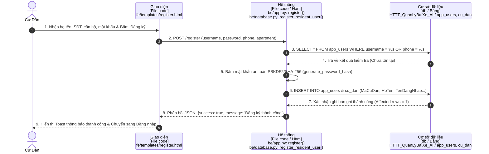

### 2. Đăng Nhập Hệ Thống
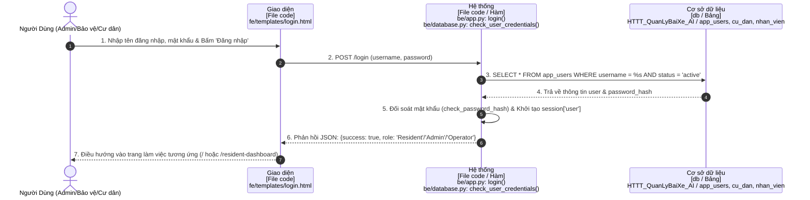

### 3. Đăng Ký Xe & Chọn Ô Đỗ Cinema
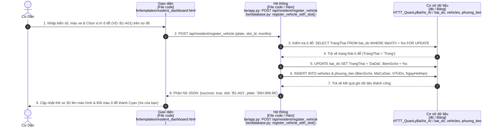

### 4. Đổi Vị Trí Đỗ Xe Cinema
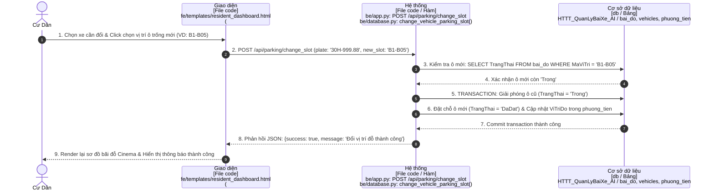

### 5. Gia Hạn Vé Tháng Cư Dân
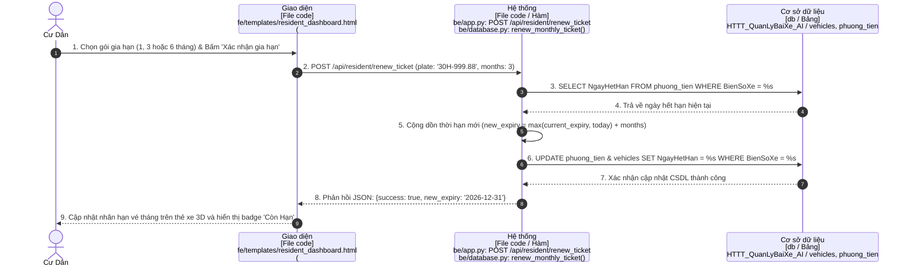

### 6. Yêu Cầu Chuyển Nhượng Xe
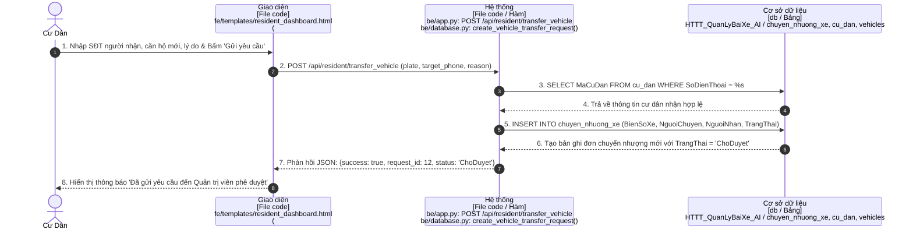

### 7. Tra Cứu Lịch Sử Vào/Ra
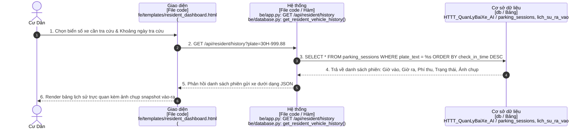

### 8. Nhận Diện AI & Tự Động Check-In Xe Vào
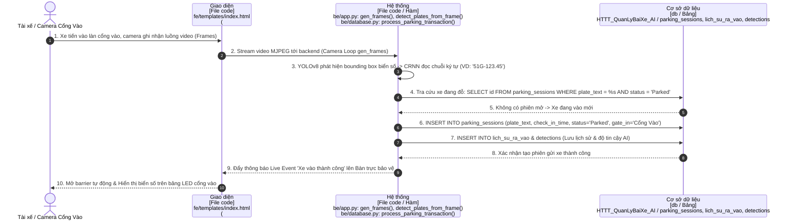

### 9. Đối Chiếu Xe Ra & Cảnh Báo Blacklist
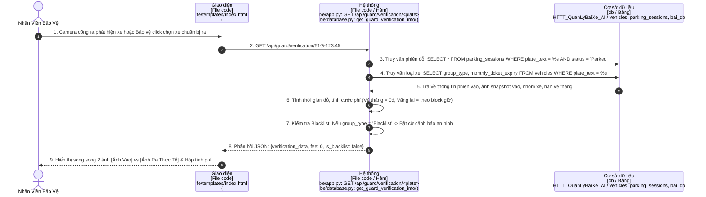

### 10. Thu Phí & Kích Hoạt Barrier Cổng Ra
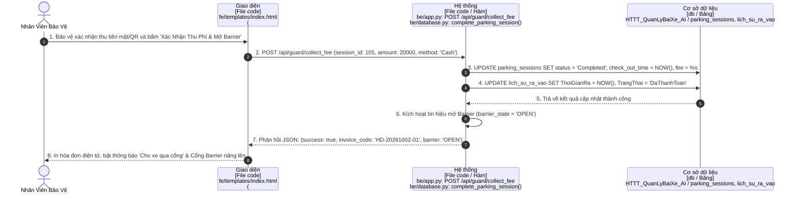

### 11. Quản Lý Tài Khoản Người Dùng (Admin)
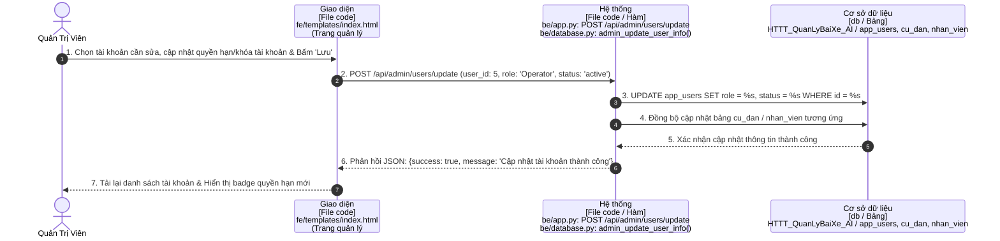

### 12. Phê Duyệt Đơn Chuyển Nhượng Xe (Admin)
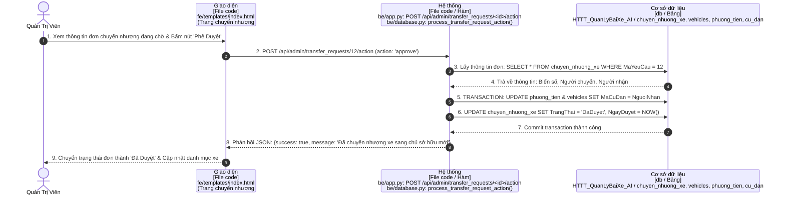

### 13. Báo Cáo Thống Kê & Doanh Thu (Admin)
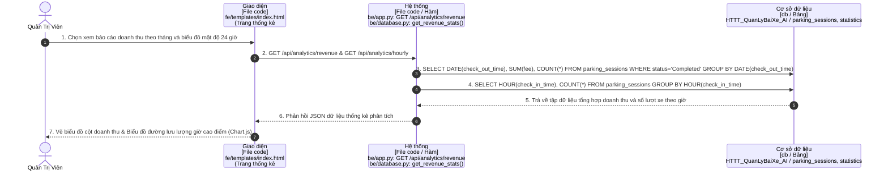

---

## 🎯 CÁCH MỞ VÀ SỬ DỤNG TRÊN DRAW.IO

1. Truy cập trình duyệt web: 👉 **[https://app.diagrams.net](https://app.diagrams.net)** (hoặc dùng ứng dụng Draw.io Desktop).
2. Chọn **Open Existing Diagram** (Mở biểu đồ đã có).
3. Duyệt và chọn file:
   - File tổng thể 13 tabs: [`docs/SO_DO_TUAN_TU_HE_THONG.drawio`](file:///d:/CNPM24CT2_OngThanQuocTruong/ongthanquoctruong_24CT2_cnpm/docs/SO_DO_TUAN_TU_HE_THONG.drawio)
   - Hoặc các file con trong thư mục: [`docs/drawio/`](file:///d:/CNPM24CT2_OngThanQuocTruong/ongthanquoctruong_24CT2_cnpm/docs/drawio)
4. Bạn có thể xuất sang **PNG**, **PDF**, **SVG** hoặc chèn trực tiếp vào Slide PowerPoint / Word báo cáo học phần.
