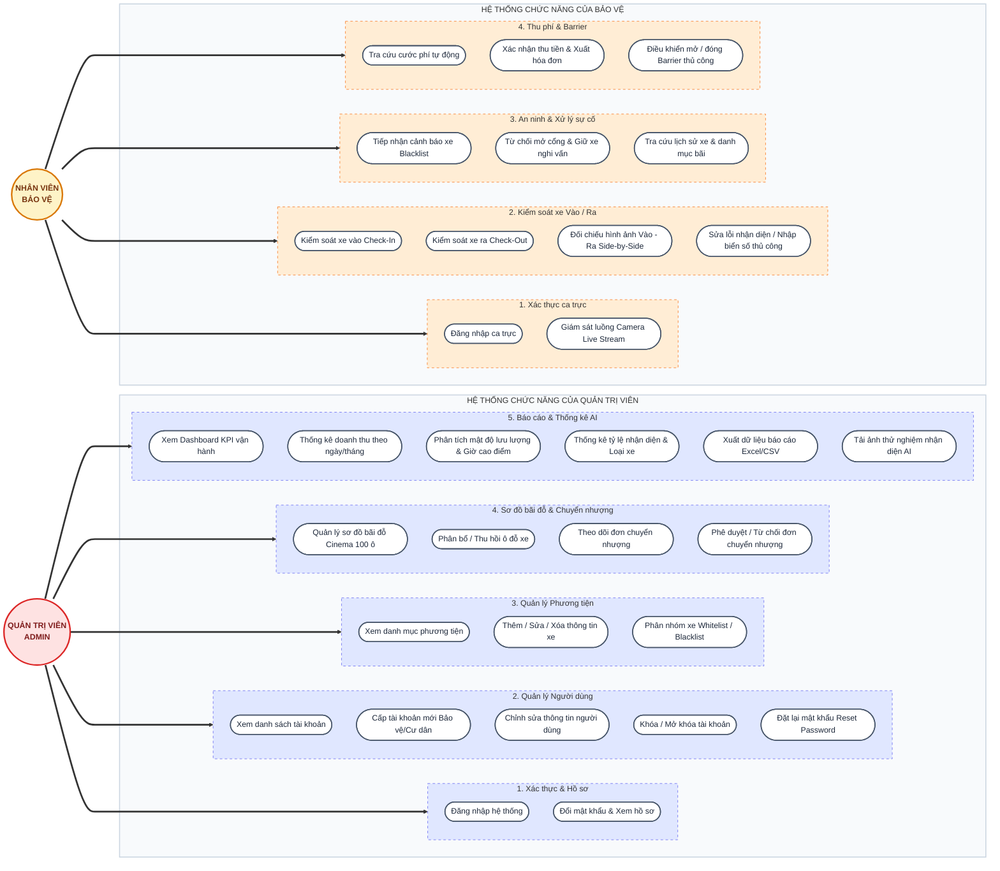

# SƠ ĐỒ CHỨC NĂNG (USE CASE) - ADMIN VÀ BẢO VỆ

Sơ đồ ERD trên GitDiagram chỉ hiển thị **Cơ Sở Dữ Liệu (các bảng lưu trữ)**. Để xem chi tiết **"Tác nhân Admin và Bảo vệ được làm những gì"**, chúng ta sử dụng sơ đồ **Use Case** dưới đây.

